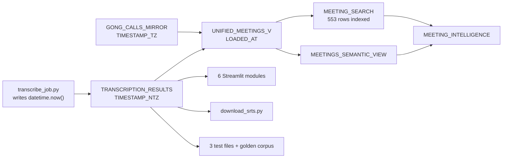

## Direct answer

**No — don't change the column's storage, at least not for this.** Three findings, in order of
how much they matter.

### 1. Snowflake will not let you, in place

Per [ALTER TABLE … ALTER COLUMN](https://docs.snowflake.com/en/sql-reference/sql/alter-table-column):
changing a column "to a different type" is **unsupported**, and `SET DATA TYPE` accepts only
`NUMBER` or a text type. So `TIMESTAMP_NTZ` to `TIMESTAMP_LTZ` means add a column, backfill,
drop, rename — or CTAS and swap. That is a full rewrite of **497 rows of irreplaceable
transcripts**, against your standing constraint about not destroying them.

### 2. The blast radius is much wider than the flag



About 15 source files reference the column, and a type change ripples through
`UNIFIED_MEETINGS_V` into the Cortex Search service (which would need reindexing), the semantic
view, and the agent. That is a migration project, not a convenience flag.

### 3. But there IS a storage-level bug, and it is one line

The payload does **not** deliberately store UTC:

```python
# scripts/payload/transcribe_job.py:634
'TRANSCRIPTION_TIMESTAMP': datetime.now().strftime('%Y-%m-%d %H:%M:%S.%f'),
```

`datetime.now()` — not `utcnow()`. It records **the container's wall clock**, which is UTC only
because the Container Runtime happens to run UTC. Two consequences:

- If that runtime's timezone ever changed, the column would silently change meaning **mid-table**,
  and because `TIMESTAMP_NTZ` carries no offset there would be no way to tell which rows are which.
- It is why this column disagrees with `TRANSCRIPTION_RUN_EVENTS.EVENT_TS`, which uses
  `CURRENT_TIMESTAMP()` (Snowflake session time) and is `TIMESTAMP_LTZ`. One value comes from
  Python's clock, the other from Snowflake's. Nothing reconciles them.

So the fix is not "store local time" — storing UTC is correct. The fix is to make the UTC
**deliberate**, convert at the edges, and write the contract down.

> Note the account already has all three types in play: `TRANSCRIPTION_TIMESTAMP` NTZ,
> `GONG_CALLS_MIRROR.CALL_START_TS` **TZ**, `EVENT_TS` **LTZ**. `EVENT_TS` is the precedent that
> already behaves well — `::DATE` and `CURRENT_DATE()` just work on it. That is the argument for a
> future LTZ migration, and it is worth making eventually. Just not inside this task.

---

## Plan

### 1. Make the payload's UTC explicit

`datetime.now()` to `datetime.now(timezone.utc)`, formatted identically.

**This changes no stored values today** — the container is already UTC, verified against the live
account. It removes the dependency on that being true. Add a comment naming the contract, since
`TIMESTAMP_NTZ` cannot express it.

Re-deploy with `05_deploy_payload.sh`, which verifies by downloading and comparing content.

### 2. Resolve the window client-side in `download_srts.py`

Two pure functions:

```python
def resolve_dates(args):
    """--today / --yesterday / --days N / --start+--end  ->  (date, date)."""

def local_day_bounds_utc(start_date, end_date):
    """[start 00:00 local, end+1day 00:00 local) as naive UTC datetimes."""
    start = datetime.combine(start_date, time.min).astimezone()
    end   = datetime.combine(end_date + timedelta(days=1), time.min).astimezone()
    return (start.astimezone(timezone.utc).replace(tzinfo=None),
            end.astimezone(timezone.utc).replace(tzinfo=None))
```

`datetime.combine(d, time.min).astimezone()` treats the value as local and attaches the machine's
real offset, so DST is handled without naming a zone. Verified here: `2026-03-08` spans 23 hours,
`2026-11-01` spans 25.

`fetch_transcripts` then takes two UTC datetimes and drops the `DATEADD`:

```sql
WHERE TRANSCRIPTION_TIMESTAMP >= %(start_utc)s
  AND TRANSCRIPTION_TIMESTAMP <  %(end_utc)s
```

**Why not `CONVERT_TIMEZONE` in SQL.** It needs a hardcoded zone name (wrong the moment the
machine differs from the session) and applies a function per row, defeating pruning. Client-side
bounds keep the predicate a plain range scan and use whatever zone the operator is actually in.

### 3. CLI surface

| Flag | Window |
|---|---|
| `--today` | local today, 00:00 to now |
| `--yesterday` | local yesterday, full day |
| `--days N` | last N local days **including today** (`--days 1` == `--today`) |
| `--start` + `--end` | explicit local dates, both inclusive |

`--start`/`--end` lose `required=True`. `--today`/`--yesterday`/`--days` go in one
`add_mutually_exclusive_group()`; the pair-vs-shortcut combination needs a manual check, since
argparse cannot express it. Reject `--start` without `--end`, a shortcut combined with explicit
dates, `--days < 1`, and `--start > --end` — each naming the flag to fix.

### 4. Print the resolved window

The conversion is invisible otherwise, and invisible date handling is what caused this:

```
Querying local 2026-09-25 (today)
  -> TRANSCRIPTION_TIMESTAMP >= 2026-09-25 04:00:00 UTC
                             <  2026-09-26 04:00:00 UTC
```

### 5. Write the contract down

Nothing currently states the column is UTC — the direct cause of this whole thread. Add to
[documents/architecture/architecture.md](documents/architecture/architecture.md) section 6:
`TRANSCRIPTION_TIMESTAMP` is **UTC in `TIMESTAMP_NTZ`**, `EVENT_TS` is **`TIMESTAMP_LTZ`**, and
consumers must convert. Record that a future LTZ migration is the real fix and why it was
deferred.

### 6. Fix two commands that are broken today

`--start`/`--end` are currently `required=True`, so both documented invocations fail immediately:

- [documents/operations/runbook.md](documents/operations/runbook.md):298 — `python download_srts.py`
- [agents.md](agents.md):108 — same

Point both at `--today`.

### Behaviour change to call out

This is **not** purely additive: an existing `--start`/`--end` invocation now returns a different
set of rows, shifted by the local offset — gaining that evening, dropping the previous one. That
is the correction, but it must be stated in the docstring, `--help`, and the runbook so someone
comparing an old export to a new one is not left guessing.

## Verification

1. Full suite green (172 plus the new cases).
2. `--today` and `--start <today> --end <today>` return the **same** rows — proving the shortcut
   is an alias, not a second code path.
3. Payload change stores byte-identical values: compare `MAX(TRANSCRIPTION_TIMESTAMP)` against
   `SYSDATE()` after a run, as today (18:32 stored vs 20:57 UTC pattern).
4. Live: `--today` finds today's 4 transcripts (stored 18:28-18:32 UTC = 14:28-14:32 EDT);
   `--yesterday` returns the 09-24 set; `--days 2` the union.
5. The printed upper bound for `--today` is tomorrow 04:00 UTC, not today 00:00 — the specific
   thing that was wrong.
6. Every rejection exits 1 naming the offending flag.
7. `python download_srts.py --today` runs clean from a fresh shell.

## Critical files

- [av.uploader/download_srts.py](av.uploader/download_srts.py) - the flags, the two helpers, and the query
- [scripts/payload/transcribe_job.py](scripts/payload/transcribe_job.py):634 - the `datetime.now()` to UTC fix
- [tests/test_av_uploader.py](tests/test_av_uploader.py) - offline tests, including the DST days
- [documents/architecture/architecture.md](documents/architecture/architecture.md) - section 6, where the UTC contract belongs
- [documents/operations/runbook.md](documents/operations/runbook.md):298 - one of the two broken commands

## Out of scope, but found on the way

- **A `TIMESTAMP_LTZ` migration.** The better end state, and worth its own plan: add column,
  backfill 497 rows, swap, rebuild `MEETING_SEARCH`, update ~15 files. Not bundled here.
- **`UNIFIED_MEETINGS_V.CALL_START_TS` is `TIMESTAMP_NTZ` while `GONG_CALLS_MIRROR.CALL_START_TS`
  is `TIMESTAMP_TZ`** — the `UNION ALL` silently coerces away Gong's offset. Separate latent bug,
  not touched here.
- `--since DATE`; `upload_av_files.py`, which has no date filtering.
