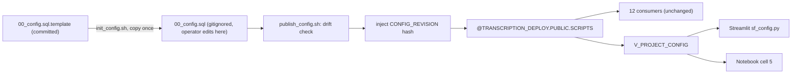

# Externalize deployment config

**Status:** pending
**Created:** 2026-09-24
**Revised:** template-and-copy per Bo, then full pre-build review against the live account

**Motivation:** Bo: *"It feels wrong to store the values under git control when these should be configurable variables per user installing the project."*

## Review findings

Verified against the account and repo before building. Five corrections:

| # | Finding | Effect on plan |
|---|---|---|
| R1 | **Teardown staleness check is not implementable.** `999_teardown.sql` runs via `snow sql -f`; SQL cannot read a local file to hash it. | **Removed** from step 5. Guard A already covers the risk by comparing a typed DB name to loaded config. |
| R2 | **Task 6 works only by role inheritance.** The view grants SELECT to `TRANSCRIPTION_APP_ROLE` only; the notebook runs as SYSADMIN. Verified `TRANSCRIPTION_APP_ROLE` **is** granted to SYSADMIN, so it inherits. A least-privilege cleanup revoking that would silently break it. | Step 6 adds an **explicit grant** to the notebook owner role and makes the fallback **loud**. |
| R3 | **"Preserve every comment verbatim" is wrong for the header.** The template's own `HOW TO CHANGE CONFIG` block says *"2. Bump CONFIG_REVISION"* and `PARALLEL DEPLOYMENTS` says *"copy this file to a new name on the stage"*. Both become false. | Step 1 splits: **rationale** comments verbatim, **workflow** comments rewritten. |
| R4 | **`publish_config.sh:47` greps `CONFIG_REVISION` from the local file** to display it. Under injection that returns the sentinel, not the real value. | Step 4 reworks the display to show the **computed** hash. |
| R5 | **A compile-check test is impractical.** The file is ~40 statements including an anonymous block, and `snowflake_sql_execute` takes one statement. `publish_config.sh` already runs `EXECUTE IMMEDIATE FROM` as verification, which is strictly stronger. | Dropped that test. |

Also confirmed: `00_config.sql` **is** tracked (so `git rm --cached` applies); `04` and `09` reference **only** the staged path, so the no-consumer-changes claim holds; pytest **9.0.3** is available; `CONFIG_REVISION` is **display-only** in consumers, so changing its format is safe.

## Context

Explored [scripts/00_config.sql](scripts/00_config.sql), [scripts/publish_config.sh](scripts/publish_config.sh), [scripts/999_teardown.sql](scripts/999_teardown.sql), [streamlit/sf_config.py](streamlit/sf_config.py), notebook cells 4 and 5, and all 12 consumers.

### The architecture is sound; only value storage is wrong

| Decision | Verdict | Why |
|---|---|---|
| Session vars via `EXECUTE IMMEDIATE FROM` | **Keep** | The documented Snowflake mechanism for controlling deployment of objects and code |
| `V_PROJECT_CONFIG` view | **Keep** | Owner's-rights Streamlit rejects session variables (`090244`), so config-as-data is the only way the dashboard can read it |
| Committed literal values | **Wrong** | Docs: *"Never commit environment-specific literals -- use variables and externalize the values"* |

### Design: template and copy, not template and render

An earlier draft split values into `config/settings.env` rendered by a Python renderer. **Rejected:** it separated every value from the comment explaining it. The 30-minute-timeout rationale, the `090244` note and the V1/V2 drift history would have lived in a file the operator never opens, while the values they edit sat context-free elsewhere. That destroys what makes `00_config.sql` good.

Template-and-copy keeps values beside their reasoning and **matches the `av.uploader/config.template.json` -> `config.json` precedent already in this repo** instead of inventing a second mechanism.



### What the copy model gives up

**Template drift.** If the template gains `PROJECT_FOO`, an existing copy lacks it and any script using `$PROJECT_FOO` fails. The well-known cost of every `.env.example` pattern, already carried by `av.uploader/config.json`. Covered by a `SET`-name diff, roughly 15 lines of bash.

### The CONFIG_REVISION wrinkle

A plain copy returns the revision to hand-editing, restoring the footgun this plan partly exists to fix. Fix is one sentinel:

```sql
SET CONFIG_REVISION = 'INJECTED_AT_PUBLISH';
```

`publish_config.sh` replaces it with a content hash over `SET` key-values only, in a temp copy that gets staged, so comment edits do not churn the revision. Hash-only, not date-prefixed: a `YYYY-MM-DD-<hash>` is not deterministic across days, which would make comparison tests date-dependent. The view already exposes `REFRESHED_AT` for recency. Keep it to 12 chars, since the dashboard displays it.

### Other findings

**Blast radius is small.** All 12 consumers use the staged path; that contract is unchanged, so **no consumer needs editing**.

**The landmines are cheap.** Four keys are marked `-- DON'T UPDATE (hard-coded in notebook)`, but the notebook already derives DB and schema from the live session. Only three *leaf* names are literal, adjacent in cell 5:

```python
STAGE_PATH = f"@{CURRENT_DATABASE}.{CURRENT_SCHEMA}.AUDIO_VIDEO_STAGE"
RESULTS_TABLE = "TRANSCRIPTION_RESULTS"
RUN_EVENTS_TABLE = "TRANSCRIPITON_RUN_EVENTS"
```

`sf_config.py` already has the tiered `config_view -> session_context -> fallback` pattern to copy.

**`--enable-templating NONE` is load-bearing.** Already in `publish_config.sh`; without it `snow sql` templating interprets the config file's own syntax. Must survive.

**Parallel deployments get better, not worse.** `04` and `09` already accept `CONFIG_STAGE_PATH` / `CONFIG_STAGE` overrides, so a second deployment is a second local copy published under a second staged name. Document that rather than the current "copy this file on the stage" wording.

### Why NOT `EXECUTE IMMEDIATE FROM ... USING()` Jinja2

Available to all accounts and it looks like the obvious answer, but it parameterizes per **invocation** while this target is fixed per **installation**: 12 call sites passing ~25 variables each, with nested calls forwarding explicitly. Recorded so nobody "modernizes" it without knowing it was rejected.

## Implementation steps

### 1. Extract the template

Capture today's `00_config.sql` as a test fixture **first**. Then `git mv scripts/00_config.sql scripts/00_config.sql.template` to preserve history.

**Comment handling is not uniform (R3):**
- **Verbatim:** the 30-minute-timeout rationale, the `090244` owner's-rights explanation, the V1/V2 drift history, the per-key `DON'T UPDATE` notes until step 6 removes them.
- **Rewritten:** `HOW TO CHANGE CONFIG` (step 2 "bump CONFIG_REVISION" disappears; step 1 becomes "edit your copy, not this template") and `PARALLEL DEPLOYMENTS` (per the `CONFIG_STAGE_PATH` note above).

Change the revision line to the sentinel. `git rm --cached scripts/00_config.sql`, gitignore it beside the `av.uploader/config.json` entry.

**Verify the ignore actually took:** `git ls-files scripts/00_config.sql` empty and `git status --short` clean. A `git mv` plus gitignore misbehaved earlier in this project, so assert rather than assume.

### 2. `scripts/init_config.sh`

Copies template to `00_config.sql`, **refusing to overwrite** an existing file -- silently clobbering an operator's edited config would be worse than the problem being solved. Prints the four core values and the edit-then-publish path.

**Ordering constraint:** between step 1 and this, no local `00_config.sql` exists and `publish_config.sh` would fail. Land steps 1 and 2 together.

### 3. Drift check in `publish_config.sh`

Diff `SET` names between template and local via `grep -oE '^SET [A-Z_]+'` and `comm`:
- **In template, not local** -> hard-fail, list the keys. The drift case.
- **In local, not template** -> warn only; could be a deliberate local extra, and failing would be hostile.

### 4. Revision injection in `publish_config.sh`

Hash the local file's `SET` key-values, stage a temp copy with the sentinel replaced, verify. **Rework the existing revision-display grep (R4)** so it reports the computed hash rather than the sentinel. Keep `--enable-templating NONE`. The injection must never yield an empty value, since `04_deploy_notebook.sh` requires `CONFIG_REVISION` in its `wanted` list.

### 5. Staleness assertion -- `04` and `09` only

```
hash(local 00_config.sql) != staged CONFIG_REVISION
  -> hard-fail: "Staged config is stale. Run ./scripts/publish_config.sh"
```

Both scripts already have verification blocks to extend. **Not added to teardown (R1)** -- SQL cannot hash a local file, and Guard A already aborts on a config mismatch with *"or the staged config is not the one you think."*

### 6. Remove the landmines

Notebook cell 5 reads the three leaf names from `V_PROJECT_CONFIG`, keeping current values as fallback, mirroring `sf_config.py`'s tiered pattern including its `SOURCE` marker.

**Two hardening requirements from R2:**
1. Add an **explicit** `GRANT SELECT` to the notebook owner role in the template's grant block. Today it works only because `TRANSCRIPTION_APP_ROLE` happens to be granted to SYSADMIN; that is an accident to depend on.
2. Make the fallback **loud** -- print a visible warning naming the reason and expose `SOURCE` in cell output. A silent fallback after a rename is the dangerous case: the notebook would target the old name while the operator believes the rename took.

Then delete the four `DON'T UPDATE` comments and the "mirrored in notebook cell 4" warning.

### 7. Tests -- see Verification

### 8. Docs

**README has 6 references**, two of them now-false instructions: line 114 *"Edit scripts/00_config.sql ... bump CONFIG_REVISION"*, and the `00_config_dev.sql` parallel-deployment guidance. Also the file-tree entry and the "single source of truth" paragraph.

Also stale: 3 comment references in [streamlit/sf_config.py](streamlit/sf_config.py) pointing at `scripts/00_config.sql`, and 2 in the gitignored skill docs (`development-workflow.md` line 35 still says "bump CONFIG_REVISION").

Add a lint check asserting `00_config.sql` is untracked.

## Verification

**Tier 0 is fully automated. Tier 1 is read-only. Tier 2 needs human action, marked HUMAN.**

Using pytest 9.0.3, confirmed available. This diverges from the project's standalone-script convention (`lint_dashboard.py` with `sys.exit(main())`) -- a deliberate choice, since a 10-test suite justifies a runner.

### Tier 0 -- offline, zero cost, no human

| ID | Test | Assertion |
|---|---|---|
| T0.1 | **Template equals today's config** | Byte-identical to the pre-change fixture except the revision line and the rewritten header block. Proves extraction changed no values. |
| T0.2 | Faithful copy | `init_config.sh` output byte-identical to the template |
| T0.3 | No-clobber | Against an existing file, exits non-zero and leaves it untouched |
| T0.4 | Drift detected | Remove a `SET` locally; preflight exits non-zero naming that key |
| T0.5 | Local extra tolerated | Add a `SET` absent from the template; warns and proceeds |
| T0.6 | Revision determinism | Two injections over unchanged content produce the same hash |
| T0.7 | Revision sensitivity | Changing a value changes the hash; editing only comments or whitespace does not |
| T0.8 | Sentinel replaced | Staged content contains no `INJECTED_AT_PUBLISH`, and the revision is non-empty |
| T0.9 | Fresh-clone simulation | Clone to temp dir: `00_config.sql` absent and untracked, template present, `init_config.sh` yields a working config |
| T0.10 | Notebook resolution harness | Fake session returning a config row uses view values; a session that raises falls back to literals **and emits the warning** |

### Tier 1 -- read-only against Snowflake

| ID | Test | Assertion |
|---|---|---|
| T1.1 | View matches local config | Every `V_PROJECT_CONFIG` column equals the corresponding local `SET` value, compared **programmatically, not by eye** |
| T1.2 | Grants intact | App role holds SELECT; after step 6, the notebook owner role holds it **explicitly**, not only by inheritance |
| T1.3 | Session vars resolve | `EXECUTE IMMEDIATE FROM` the staged file; the load echo returns expected values |
| T1.4 | Revision agreement | Staged `CONFIG_REVISION` equals the locally computed hash |
| T1.5 | **Migration is a no-op** | Local working copy is byte-identical to the **currently staged** file except the revision line. The safety proof that republishing cannot change live config -- run this *before* HUMAN 1. |

### Tier 2 -- writes to the live account. HUMAN ACTION REQUIRED

**HUMAN 1 -- approve publishing config.** Write to a shared stage 12 scripts read. De-risked by T1.5, which proves the content is unchanged.

**HUMAN 2 -- approve notebook and dashboard redeploy** after step 6. Both do `CREATE OR REPLACE`.

**HUMAN 3 -- eyeball the dashboard once.** Confirm Pipeline Status renders and the revision caption shows the new hash. Not automatable: SiS needs an authenticated browser session. Worth doing because the `python==3.11` incident proved a fully-verified deploy can still fail at render time.

**HUMAN 4 -- approve the cheap rename proof.** Rename **`PROJECT_RUN_STATUS_VIEW` only**: a view holds no data and is recreatable at no cost, so setup recreates it and the dashboard proves resolution. Then revert. Deliberately avoids `TRANSCRIPTION_RESULTS` and the 447 transcripts under the standing do-not-destroy constraint.

| ID | Test | Assertion |
|---|---|---|
| T2.1 | Publish round-trip | T1.1--T1.4 all pass after publish |
| T2.2 | **Staleness desync** | Edit local config without publishing; `04` and `09` both hard-fail with the fix instruction; republish; both pass. Touches only a gitignored file, so the failing half is free |
| T2.3 | Teardown guard | With a deliberate desync, run `999_teardown.sql` at `TEARDOWN_LEVEL = 0`. **Non-destructive by design** -- Guard B aborts first. Assert the mismatch surfaces |
| T2.4 | Rename resolves | Under HUMAN 4: dashboard picks up the renamed view; revert after |

### Explicitly not proposed

- **A GPU run** to prove the notebook reads a renamed table: ~6 min GPU, ~75% hang odds, manual pool reclaim. T0.10 proves the logic offline; the first real run confirms it free. Say so if you want it.
- **A parallel-deployment install test** creating a second DB, warehouse and GPU pool. T0.9 covers the local half.

**No GPU run required in the recommended set.**

## Critical files

- [scripts/00_config.sql](scripts/00_config.sql) - becomes the template; rationale comments verbatim, workflow comments rewritten
- [scripts/publish_config.sh](scripts/publish_config.sh) - drift check, revision injection, and the R4 display fix
- [streamlit/sf_config.py](streamlit/sf_config.py) - the tiered pattern to copy; also has 3 stale path comments
- [notebooks/audio_video_transcription.ipynb](notebooks/audio_video_transcription.ipynb) - cell 5 holds the three leaf names
- [scripts/999_teardown.sql](scripts/999_teardown.sql) - Guard A already couples config to a typed confirmation; unchanged, but must stay correct

## Scope note

Steps 1--5 fix the git complaint and the footgun, touching no consumer. Step 6 makes the template honest rather than decorative. Step 8 is required because the documented install path changes.

**Out of scope:** notebook cell 4's behavioural config (`WHISPER_MODEL`, `HANG_FORENSICS`, `FORCE_KERNEL_EXIT`). Arguably per-installation, but read before any session config exists, so moving them means rewriting cell 4's load order for little gain. Revisit with the job-service port.

**Known unrelated issue, not a blocker:** `scripts/03_automate.sql` bare `DECLARE...END;` blocks fail under `snow sql -f`. Do not chain it into any test.
