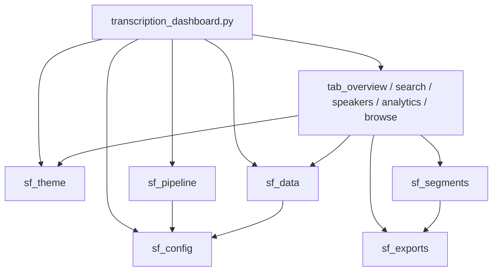

# Modularize the dashboard into `streamlit/` and apply Snowflake theming

## Context

`transcription_dashboard.py` is 1,840 lines in a single file at the repo root. The structural
problem is concentrated: **`main()` alone is 753 lines** (41% of the file) because all five tab
bodies are inline. The rest is already reasonably factored into 19 functions.

Measured breakdown:

| Region | Lines | Destination |
|---|---|---|
| `main()` | 753 | entrypoint + 5 tab modules |
| Export builders (CSV/SRT x4 + 2 helpers) | 462 | `sf_exports.py` |
| Segment matching and rendering (5 fns) | 288 | `sf_segments.py` |
| Data queries (4 fns) | 160 | `sf_data.py` |
| Pipeline status (4 fns) | 155 | `sf_pipeline.py` |
| CSS block + page config | 68 | `sf_theme.py` |
| Object names and constants | 51 | `sf_config.py` |
| `get_snowflake_connection` | 9 | `sf_config.py` |

### Decisions taken

| Question | Decision |
|---|---|
| Branding depth | **Theme colors only** — native `[theme]` config, no gradient banner, no new heading CSS |
| Status colors | **Keep semantic** green/orange/red; brand only the structural chrome |
| Streamlit version | **Leave unpinned** — no `environment.yml`; the existing `st.fragment` fallback covers older runtimes |

### Verified platform constraints

**Flat layout is mandatory.** Warehouse runtime requires that "your entrypoint file can have any
name but **must be located in the root of your source directory**." Python puts that root on
`sys.path`, so sibling modules import cleanly. A `lib/` subpackage would probably work but is not
the documented shape, so every module sits flat beside the entrypoint.

**Do not create a `pages/` directory.** Streamlit treats `pages/` as automatic multipage
navigation, which would restructure the app. Tab modules are named `tab_*.py` deliberately.

**`[theme]` and `[theme.sidebar]` are both supported** on warehouse runtime, per the
configuration support matrix. `[server]`, `[client]`, `[global]`, `[browser]` and `[logger]` are
**not** — so nothing else belongs in `config.toml`.

**Lato is unavailable, and this is a real deviation from the branding skill.** The skill mandates
Lato via the Google Fonts CDN, but the SiS Content Security Policy blocks loading fonts from
external domains, and static file serving is unsupported on warehouse runtime. There is no way to
serve Lato here. The plan uses the brand *colors* faithfully and falls back to
`font = "sans serif"`. This limitation must be recorded in the docs so nobody re-attempts it.

**The app is a `FROM`-based Streamlit object**, confirmed by `DESCRIBE` returning
`live_version_location_uri` and no `root_location`. That is what makes multi-file editing in
Snowsight work at all, so it must stay `FROM`-based.

### Import-order hazard, and how it is handled

Object names are resolved from the live session, so they cannot be module-level constants that
other modules import by value — `from sf_config import T_RESULTS` would bind `None` at import
time, before the session exists. Instead `sf_config` exposes a mutable holder:

```python
# sf_config.py
class _Names:  ...
NAMES = _Names()          # attributes filled in by init()

def init(session): ...    # called once from the entrypoint
```

Consumers do `from sf_config import NAMES` and read `NAMES.T_RESULTS` **at call time**. This is
the specific reason for the holder object rather than plain constants; a comment in `sf_config`
must say so, because "simplifying" it back to constants would break silently at import.

## Target structure

```
streamlit/
├── .streamlit/
│   └── config.toml           # [theme] + [theme.sidebar] only
├── transcription_dashboard.py  # entrypoint - MUST stay at root
├── sf_config.py              # session, NAMES holder, MAX_UPLOAD_MB, SUPPORTED_EXTS
├── sf_theme.py               # BRAND palette dict, inject_css(), status card renderer
├── sf_data.py                # load_transcription_data, get_summary_stats,
│                             #   get_speaker_segments, search_transcriptions
├── sf_pipeline.py            # get_run_status, get_task_state, get_backlog,
│                             #   render_status_panel  (+ kickoff/upload later)
├── sf_segments.py            # find_matching_segments_with_context, highlight_text,
│                             #   display_search_result_with_speakers, display_speaker_transcript
├── sf_exports.py             # convert_* CSV/SRT builders, create_csv_download, srt_download_link
├── tab_overview.py           # render(df, stats)
├── tab_search.py             # render(session, df)
├── tab_speakers.py           # render(session, df)
├── tab_analytics.py          # render(df)
└── tab_browse.py             # render(df)
```

Each tab module exposes a single `render(...)` function taking exactly what it needs. No tab
imports the entrypoint, so there are no cycles.

The entrypoint keeps its current filename so `MAIN_FILE` does not change, and drops to roughly
130 lines: page config, CSS injection, `sf_config.init(session)`, sidebar, status panel, the
empty-data guard, and five `render()` calls.



## Implementation steps

### 1. Create `streamlit/.streamlit/config.toml`

```toml
[theme]
base = "light"
primaryColor = "#29B5E8"              # Snowflake Blue - buttons, focus, active tab
backgroundColor = "#FFFFFF"
secondaryBackgroundColor = "#F0F7FB"  # Light Blue Tint - widgets, tables, code
textColor = "#333333"                 # brand Dark Gray
linkColor = "#11567F"                 # Mid Blue
font = "sans serif"                   # Lato is NOT loadable - see note below

[theme.sidebar]
backgroundColor = "#F8FBFC"           # brand Near-White
secondaryBackgroundColor = "#F0F7FB"
primaryColor = "#29B5E8"
textColor = "#333333"
```

Include a comment in the file recording that `linkColor` and `[theme.sidebar]` are newer options
that are silently ignored on older Streamlit builds (harmless), and that Lato cannot be used.

### 2. `sf_config.py`

Move `get_snowflake_connection()` verbatim, plus the `NAMES` holder and `init(session)` deriving
`FQ_SCHEMA`, `T_RESULTS`, `T_RUN_EVENTS`, `V_RUN_STATUS`, `STAGE_AV`, `TASK_NAME`, `FQ_TASK`,
`FQ_GATE_PROC` from `get_current_database()`/`get_current_schema()`, with the existing V2 fallback.
Carry over `MAX_UPLOAD_MB = 200`, `SUPPORTED_EXTS`, `PHASE_TOTAL`, and the comments explaining
*why* the 200 MB cap is not configurable and why names are derived rather than hardcoded.

### 3. `sf_theme.py`

A `BRAND` dict of the palette (named entries: `SF_BLUE`, `MID_BLUE`, `DARK_BLUE`, `NAVY`,
`LIGHT_TINT`, `NEAR_WHITE`, `BORDER`, `TEXT`, `TEXT_MUTED`, `STAR_BLUE`) plus `inject_css()`
holding the existing 52-line CSS block, retinted where the current colors are arbitrary rather
than meaningful:

| Class | Now | Becomes | Why |
|---|---|---|---|
| `.metric-container` accent | `#1f77b4` | `#29B5E8` | matplotlib default -> brand blue |
| `.info-box` accent | `#0066cc` | `#11567F` | arbitrary blue -> Mid Blue |
| `.info-box` background | `#e7f3ff` | `#F0F7FB` | -> brand Light Tint |
| `.speaker-segment` accent | `#4CAF50` | unchanged | semantic (speaker identity) |
| `.speaker-label` | `#2E7D32` | unchanged | semantic |
| `.transcript-box` border | `#e0e0e0` | `#E0E8ED` | -> brand Light Gray |

Also move the `STATE_STYLE` map here (status colors unchanged, per the decision) and the status
card renderer, so all presentation lives in one module.

Note in the file that `.metric-container` is currently defined but never applied anywhere — either
use it in `tab_overview` or delete it; do not leave it dead.

### 4. Split the data, segment and export layers

Mechanical moves, no logic changes:

- `sf_data.py` — the four query functions. Replace their `{T_RESULTS}` references with
  `{NAMES.T_RESULTS}`.
- `sf_segments.py` — `find_matching_segments_with_context`, `highlight_text`,
  `display_search_result_with_speakers`, `display_speaker_transcript`.
- `sf_pipeline.py` — `get_run_status`, `get_task_state`, `get_backlog`, `render_status_panel`.
- `sf_exports.py` — the four `convert_*` builders, `create_csv_download`, `srt_download_link`.

Two known defects to resolve during the move rather than carrying forward:

- **`convert_speaker_segments_to_srt` (42 lines) is dead code.** Nothing calls it; the live path
  uses the pre-generated `SRT_CONTENT` column. Delete it, and note in the docs that
  `convert_search_results_to_srt` *is* live, so search-result SRTs are still built client-side —
  inconsistent with the pre-generate rule, and worth a follow-up.
- **`create_csv_download(df, filename)` ignores `filename`.** Drop the unused parameter and fix
  its two call sites.

### 5. Split `main()` into five tab modules

Extract each `with tabN:` body into `tab_*.py` as `render(...)`, dedenting one level. Signatures
pass state explicitly instead of relying on closure over `main()`:

| Module | Signature |
|---|---|
| `tab_overview` | `render(df, stats)` |
| `tab_search` | `render(session, df)` |
| `tab_speakers` | `render(session, df)` |
| `tab_analytics` | `render(df)` |
| `tab_browse` | `render(df)` |

Three hazards specific to this extraction:

- **Widget keys must stay unique and unchanged.** `tab_search` and `tab_speakers` both build keys
  like `f"csv_{idx}_{row['FILE_NAME']}"` and `f"csv_{clean_filename}"`. Preserve the exact
  existing key strings; changing them resets widget state and can collide across modules.
- **`expander_label` is assigned inside a `with col1:` block and consumed outside it** in the
  search tab. It works only because that branch always runs. When extracting, hoist it to a
  normal local before the column block.
- **`df` is mutated in place** by three tabs (`df['DATE']`, `df['FILE_SIZE_MB']`,
  `df['WORD_COUNT']`). Since the tabs now run as separate function calls over the same frame,
  keep the assignments idempotent or compute into locals; do not let one tab depend on a column
  another tab added.

### 6. Rewrite `scripts/09_deploy_dashboard.sh` for a directory

The script currently `PUT`s a single file and verifies one download. It must now:

- `PUT file://<streamlit>/*.py` and the `.streamlit/config.toml` to
  `@STREAMLIT_STAGE/TRANSCRIPTION_DASHBOARD/`, preserving the `.streamlit/` subpath
- Keep `AUTO_COMPRESS = FALSE` (sources must stay readable) and `OVERWRITE = TRUE`
- **Delete stale files.** `CREATE OR REPLACE ... FROM` copies whatever is in the stage directory,
  so a module removed locally would linger and could shadow a stdlib name. Since `REMOVE` is
  blocked under owner's rights but the *deploying* role is not owner-restricted, the script can
  `REMOVE @stage/TRANSCRIPTION_DASHBOARD/` before uploading. Confirm the old
  `streamlit/transcription_dashboard.py` copy under the orphan `JJ548C_5ROCDKNPO/` prefix is left
  alone or cleaned deliberately.
- Verify **every** file by downloading the directory back and diffing each against local, not just
  the entrypoint
- Keep the existing owner assertion, which is the escalation guard

### 7. Update project wiring

- `snowflake.yml` — point `main_file` and `artifacts` at the `streamlit/` directory. Note this
  file is *not* what the deploy script uses; it exists for `snow streamlit` compatibility, so
  either update it consistently or delete it to avoid a second source of truth. Recommend
  updating, with a comment that `09_deploy_dashboard.sh` is authoritative.
- `git mv transcription_dashboard.py streamlit/transcription_dashboard.py` so history follows.
- `documents/architecture/architecture.md` — dashboard path and the new module inventory.
- `documents/architecture/dashboard.md` — this becomes the natural home for the module map and the
  App Runtime port notes (task 8 of the parent plan).
- Regenerate `architecture.drawio` via the `drawio-diagrams` skill with round-trip validation.
- `DIARY.md` entry.

## Verification

**Static, before any deploy:**
- `python -m ast` parse of all 12 modules
- `python -m compileall streamlit/` clean
- Import-order check: confirm no module reads `NAMES.*` at import time (grep for `NAMES.` outside
  function bodies)
- No module named `config.py`, `data.py`, `json.py`, `io.py` or similar stdlib shadow
- No `pages/` directory created
- Confirm every function in the pre-split file is either present in a new module or explicitly
  deleted (the two dead items in step 4). Diff the function inventory before and after — the
  count must reconcile exactly.

**Behavioural, after deploy:**
- All five tabs render, and the status panel still renders above them
- Sidebar controls work: record limit, Refresh Data, Debug Mode, Auto-refresh, Rescan stage
- Search returns hits for a known term; speaker view renders segments; CSV and SRT downloads
  produce non-empty files with unchanged filenames
- Query count per rerun is unchanged — confirm via `INFORMATION_SCHEMA.QUERY_HISTORY` that
  splitting the file did not introduce duplicate queries (the speaker tab already fires
  `get_speaker_segments` twice; that count should stay at two, not grow)
- Theme applied: buttons and active tab in `#29B5E8`, sidebar in `#F8FBFC`
- Status colors unchanged: green COMPLETE, orange HUNG, red STALLED
- Deploy script's content diff and owner assertion both pass

**Rollback:** the previous single-file app is commit `ac240d0`. Redeploying it is
`git checkout ac240d0 -- transcription_dashboard.py` followed by the old deploy path, so keep that
commit reachable until the modular version is confirmed working in the browser.

**Data safety:** this task touches no data. `TRANSCRIPTION_RESULTS` must remain at **444 rows**
throughout; check before and after.

## Critical files

- [transcription_dashboard.py](transcription_dashboard.py) - the 1,840-line source being split; `main()` at 1078-1830 is the bulk of the work
- [scripts/09_deploy_dashboard.sh](scripts/09_deploy_dashboard.sh) - single-file deploy that must become a directory deploy, keeping both verification gates
- [snowflake.yml](snowflake.yml) - second source of truth for app layout; update or remove
- [scripts/00_config.sql](scripts/00_config.sql) - already carries `PROJECT_STREAMLIT` and `PROJECT_APP_ROLE`; no change expected, confirm
- [documents/architecture/architecture.md](documents/architecture/architecture.md) - dashboard path and object inventory need updating, then diagrams regenerated

## Out of scope

- The four existing f-string SQL interpolation sites (flagged previously; new code uses binds)
- Kickoff button and upload control - tasks 6 and 7 of the parent plan, which land in
  `sf_pipeline.py` after this refactor
- Container-runtime migration, which would lift the 200 MB upload cap and allow real Lato
- The duplicate `get_speaker_segments` call and the `.head(20)` Browse cap
