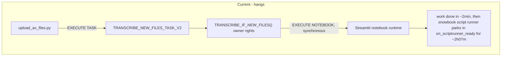
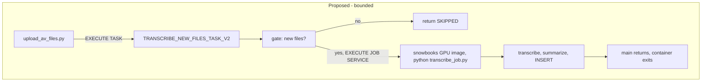

# Port transcription from EXECUTE NOTEBOOK to a headless GPU job service

## Context

### Why

The \~2h07m hang is **not in our code, and this is now proven** rather than inferred.

On 2026-08-19 a `faulthandler` watchdog was armed in the notebook teardown (`dump_traceback_later(120, repeat=True, exit=False)`, writing to a real fd via `sys.__stderr__`) and a hang was reproduced deliberately with the same 3-file workload that hung on 2026-08-18. The notebook finished all work and wrote its 3 rows normally, then dumps fired at +2min and +4min with an **identical** frame:

```
Thread 0x00007fcf7d7fa6c0:
  threading.py:355 in wait_for
  snowbook/runtime/notebook_script_requests.py:232 in on_scriptrunner_ready
  snowbook/runtime/notebook_script_runner.py:286 in _run_script_thread
MAIN THREAD:
  asyncio/base_events.py:603 in run_forever
  snowbook/snowflake/snowflake_run_adaptor.py:264 in run_till_end
  snowbook/snowflake/streamlit_base_adaptor.py:96 in start
  snowbook/web/cli.py:211 in main
```

`snowbook`'s script runner parks forever in `on_scriptrunner_ready` waiting on a condition variable while the main thread sits in `asyncio run_forever` serving gRPC. **No notebook code is on any stack** — every cell has completed. This is inside Snowflake's runtime and cannot be fixed from the notebook. `EXECUTE NOTEBOOK` is synchronous, so the calling task blocks with it.

### Re-confirmed against a live hang, 2026-08-19 15:52 — and what it means for this port

A second hang was caught **while wedged** and sampled for 20 minutes: **11 dump cycles at exactly
120s intervals, identically sized stacks throughout** (10 threads, 63 frames), and **zero notebook
frames** in any post-completion dump. Across 35 minutes of telemetry exactly one frame belonged to
project code — cell 35 calling `dump_traceback()` itself.

That capture sharpens three things for this plan:

**1. The four parked threads are ALL notebook-runtime machinery, which is why this port should
work.** Previously this was reasoned; now it is enumerated. The threads that never wind down:

| Frame | Thread's job | Exists in a headless script? |
|---|---|---|
| `notebook_script_requests.py:232 on_scriptrunner_ready` | waiting for the *next* cell-execution request | No |
| `snowflake_run_adaptor.py:264 run_till_end` → `asyncio run_forever` | serving gRPC for the notebook UI | No |
| `web/stage_copier.py:803 stage_file_watcher` | syncing notebook files to/from stage | No |
| `status_updater/status_thread.py:145 status_fun` | reporting notebook status | No |

Every one is tied to hosting an interactive notebook. `python transcribe_job.py` starts none of
them. This is the strongest evidence yet that the port removes the failure mode rather than
relocating it.

**2. HARD REQUIREMENT: never invoke `snowbook.web.cli`.** The live stack begins
`runpy.py:196 _run_module_as_main` → `web/cli.py:379 <module>` → `web/cli.py:211 main`, meaning
snowbook is started as `python -m snowbook.web.cli`. **This port reuses the same snowbooks image**,
so that module is present in the container and is one command line away from reintroducing the
exact hang. The service spec `command` must be `python transcribe_job.py` and must never be
`python -m snowbook...`. Reusing the image is safe; invoking its entrypoint is not. Assert this
in review of the service spec.

**3. The script runner does NOT exit after the last cell** — it stays alive and *moves* from
executing the notebook into `on_scriptrunner_ready`. That frame is absent from the baseline dump
and present in every dump afterwards, which marks the moment the hang begins. Do not model this as
"cleanup failed to run"; nothing is trying to clean up.

**Scope note: this is a cost and observability fix, not a correctness fix.** Both hangs on
2026-08-19 committed all 3 rows, with summaries and SRTs intact, before wedging. Across every hang
observed, no transcript has ever been lost. The port's value is reclaiming GPU time leaked by hung
runs — **which is indefinite, not the ~30 min the task timeout suggests** (see "the timeout does not
stop the container" below) — and getting a truthful task status. Not repairing corrupted data.
Weigh it accordingly, and do not let the port introduce a data risk that the hang never posed.

**The task timeout does NOT stop the container — corrected 2026-08-19.** This matters for sizing the
benefit of this port. `USER_TASK_TIMEOUT_MS` kills the task, not the notebook container. The 15:52
hung run's task died at 16:22:06 while its container `STPLATNOTEBOOK23090324279953822` was still
`RUNNING` at 16:57 — 35 minutes past task death, 65 minutes total — and had to be stopped manually
with `ALTER COMPUTE POOL ... STOP ALL`. It would never have self-resolved: the service has
`auto_suspend_secs = 0`, and the pool's `AUTO_SUSPEND = 3600` only counts *idle* time, which a
RUNNING service prevents. So **each hung multi-file run leaks a `GPU_NV_S` node indefinitely.** At 6
of 8 multi-file runs hanging, that is the real cost case for this port, and a plausible contributor
to the historical ~230-credit runaway.

**Add to task 6 validation:** after a ported run, confirm `SHOW COMPUTE POOLS` reports
`num_services = 0` and `num_jobs = 0`, and that the pool reaches `SUSPENDED` on its own. A job
service that exits should release the node without intervention — verify it, since this is the
failure the notebook path hides.

**The hang is multi-file-only:** 0 of 8 single-file runs hung; **6 of 8** multi-file runs did
(as measured 2026-08-19). Any reproduction must use 3+ files.

**Rate re-checked 2026-09-24: still live, but do not read the raw ratio as improvement.** In the
7-day `TASK_HISTORY` window, **1 of 6** runs hung — and it was the **only** run with 4 files. Every
1-2 file run passed. The file-count correlation holds; recent batches have simply been smaller. The
6-of-8 figure for 3+ file runs is **not contradicted, only un-remeasured**: seven 3-file runs exist
since 08-28, but only one (09-17, which passed) falls inside the retention window. Do not size this
port on "1 in 6".

**The leak hypothesis is now REFUTED by direct measurement, which strengthens the case for this
port.** A resource ledger deployed 2026-08-19 instrumented the 09-21 hung run at every per-file
boundary: `fd=76 threads=12 nondaemon=3 os_children=1 tmp_wav=0` held **constant across all four
files**, with `created=4 removed=4 unaccounted=0 on_disk=0 OK` — and then the container hung for 23
minutes. Nothing accumulated. The hang is a **race inside snowbook**, established by measurement
rather than inferred from a teardown census, so no notebook-side fix exists. Two incidental
corrections from that data: `os_children` is persistently **1** (an OS child that
`multiprocessing.active_children()` reports as 0 and cannot see — the blind spot behind the
original "zero children" claim), and `nondaemon` is **3**, not 2.

**It is intermittent — one clean run proves nothing.** Three 3-file runs on 2026-08-19 went
hang (10:07) / clean (15:21) / hang (15:52) within six hours. That clean run was nearly read as
the problem receding.

Three earlier hypotheses were **disproven** by the hung-run stacks and must not be re-investigated: lingering multiprocessing children (zero on every dump), GPU/CUDA cleanup (the hung run had cleanup and hung anyway), and `join_if_started` (present in healthy baselines only). The `resource_tracker: leaked semaphore` warning appears on healthy runs too and is noise.

The port remains the right move, and the evidence strengthens it: a plain Python script has no `snowbook` script runner, no Streamlit host, and no IPython kernel, so it removes the entire failure class rather than betting on a specific thread.

Switching notebook *varieties* (Warehouse vs Container Runtime, CPU vs GPU) would not help: all Snowflake notebooks are Streamlit-hosted, and Warehouse runtime cannot provide a GPU for Whisper.

**Interim mitigation already in place:** `USER_TASK_TIMEOUT_MS = 1800000` (30 min, task-scoped) caps the task — **but not the container, which leaks a GPU node indefinitely; see above.** Rows still land before the hang, so the data is correct while the task reports FAILED. Diagnostic instrumentation (`HANG_FORENSICS = True`) is currently armed in the deployed notebook — **leave it armed until the port is validated**; it produced the live 11-cycle stack capture on 2026-08-19 that proved the root cause, and it costs nothing on healthy runs (one baseline dump).

**The terminal error is not a stable signature.** Do not key validation or alerting on one error code. The 10:07 hang died at 1045s with error **604** "SQL execution canceled"; the 15:52 hang ran the full timeout and died at 1802s with error **000630** "Statement reached its statement or warehouse timeout of 1,800 second(s)". Neither message mentions notebooks or hanging. The durable signal is *transcripts present + task FAILED*, and the reliable tell is the gap between the last transcript write and the task end (7.5 min and ~10 min respectively) — not duration.

### Key findings from research

**No Docker image build is required.** The GPU Container Runtime image is available in the account:

```
snowflake/images/snowflake_images/st_plat/runtime/x86/generic_gpu/runtime_image/snowbooks:2.5.1-py310
```

This is the same `snowbooks` image family the notebook already runs on. Newer tags (2.7.0, 2.8.0) are py312-only; the notebook logs show `cpython-3.10`, so a `py310` tag matches the validated environment. `2.5.1-py310` is the newest py310.

**ffmpeg is already preinstalled** — telemetry confirms `ffmpeg version 6.1.1-3ubuntu5` plus `ffprobe` on every run. The `apt-get` fallback in notebook cell 8 has never fired, and scripts/install\_ffmpeg.sh is vestigial. This matters because job service containers are **non-privileged**, so `apt-get` would not have worked. Since we reuse the same image, ffmpeg comes for free and no static-binary or pip-wheel workaround is needed.

**Authentication inside the container differs from the notebook.** `get_active_session()` will not be available. Job service containers get an OAuth token file:

```python
def get_login_token():
    with open('/snowflake/session/token', 'r') as f:
        return f.read()

conn = snowflake.connector.connect(
    host=os.getenv('SNOWFLAKE_HOST'),
    account=os.getenv('SNOWFLAKE_ACCOUNT'),
    token=get_login_token(),
    authenticator='oauth',
)
```

The session runs as the **service owner role**. The token file is refreshed every few minutes; once connected, the connection is not bound to the token's 1-hour validity.

**`EXECUTE JOB SERVICE` is synchronous.** That is fine — the whole point is that a plain script exits when `main()` returns, so synchronous blocking is bounded by real work.

**Open risk on the launch site.** Owner's-rights stored procedures are documented to allow only SELECT, DML, DDL, GRANT/REVOKE, variable assignment, and DESCRIBE/SHOW. `EXECUTE JOB SERVICE` is not on that list, so it may be rejected inside `TRANSCRIBE_IF_NEW_FILES()` (`EXECUTE AS OWNER`) — the same way `LIST` was rejected earlier in this project. However `EXECUTE NOTEBOOK` works there today, so the allow-list is not strictly predictive. This must be tested early (task 2), with a clean fallback.

### Notebook inventory

**Re-measured 2026-09-24: 1,814 lines of code across 19 code cells** (36 cells total). Grew from \~1,312 before the 2026-08-19 progress instrumentation and \~1,671 at the last measurement; the resource ledger added the most recent \~150. Realistic target is **650-750 lines** of headless Python, plus the progress emitter. The work concentrates in a few places:

- **Cell 19 (`helper_functions`) is 526 lines** — the largest cell and the bulk of the port. Pure functions with no notebook coupling; ports nearly verbatim. Contains the load-bearing `import re`. **8 of its functions were already extracted on 2026-09-24** into `scripts/payload/transcribe_functions.py`, AST-verified identical, and are now covered by 122 offline tests — see the prerequisite note on task 4. Reuse that module rather than re-extracting.
- **Cell 5 session bootstrap is 260 lines** and must be rewritten (OAuth instead of `get_active_session`, drop `session.use_role("SYSADMIN")`, drop the unused `Root(session)`). It also now holds `RunProgress` (task 4b) and the resource ledger (task 4c).
- Cells 26, 30, 31, 32, 35 and cell 10 are presentation-only and get dropped, including the entire teardown apparatus.
- Cell 12 is a duplicate `openai-whisper` install and gets dropped.
- **Cell 28 is 154 lines.** Its `except` branch is **dead and broken** — it supplies 14 positional values against a 23-column table. Do not port it; replace with a real error path.
- `media_files/` is a relative path dependent on cwd; use an absolute temp dir.

Only `openai-whisper` and `pandas` need installing; `torch` comes from the image.

### Architecture





The uploader, the task, and the gate logic are all unchanged in behaviour. Only the payload execution vehicle changes.

## Implementation steps

### 1. Spike: validate every assumption (do this first, before writing the payload)

Run a throwaway `EXECUTE JOB SERVICE` on `TRANSCRIPTION_GPU_POOL_V2` using the snowbooks GPU image, with `TRANSCRIPTION_PYPI_ACCESS_INTEGRATION_V2` and `TRANSCRIPTION_ALLOW_ALL_INTEGRATION_V2` attached, that prints:

- `sys.version` (expect 3.10, matching the notebook)
- `shutil.which('ffmpeg')`, `ffmpeg -version`, `shutil.which('ffprobe')`
- `torch.cuda.is_available()`, `torch.cuda.get_device_name(0)`
- OAuth connection working: `SELECT CURRENT_ROLE(), CURRENT_WAREHOUSE(), COUNT(*) FROM TRANSCRIPTION_RESULTS`
- Contents of the mounted `AUDIO_VIDEO_STAGE` volume
- Whether `pip install openai-whisper` succeeds and how long it takes

Also confirm log retrieval works via `SYSTEM$GET_SERVICE_LOGS` and that stdout reaches `SNOWFLAKE.TELEMETRY.EVENTS` for durable logs.

If ffmpeg is absent in this image (contradicting the notebook evidence), stop and reassess — options are a pip wheel bundling a static binary, a staged static binary, or a Custom Runtime Environment.

### 2. Decide the launch site

Test `EXECUTE JOB SERVICE` from inside an `EXECUTE AS OWNER` procedure.

- If permitted: swap `EXECUTE NOTEBOOK` for `EXECUTE JOB SERVICE` inside `TRANSCRIBE_IF_NEW_FILES()` — smallest possible change.
- If rejected: refactor so the gate procedure only **decides** (returns `LAUNCH` or `SKIP` plus the file count) and the **task body** performs `EXECUTE JOB SERVICE`. Task bodies run as the task owner and are not bound by the stored-procedure allow-list. This keeps the gate logic in one place and avoids granting the uploader's service role privileges on the compute pool.

Prefer the task-body variant if there is any doubt; it is more robust and does not change the security model.

### 3. Extract the headless payload

Create `scripts/payload/transcribe_job.py`:

- Config via `argparse` with env-var fallbacks: `--database`, `--schema`, `--stage`, `--results-table`, `--whisper-model`, `--force-retranscribe`, `--limit`, `--dry-run`, `--work-dir`
- OAuth session helper as shown above, wrapped so the same script can also run locally with a named connection (needed for task 4)
- ffmpeg/ffprobe preflight that fails fast with a clear message
- Port cell 19's 9 functions verbatim, keeping `import re`
- Convert the implicit globals cell 19 relies on (`model`, `session`, `DIARIZATION_AVAILABLE`, `diarization_pipeline`) into explicit parameters or a small class
- Explicit `device` selection plus a startup assertion on `torch.cuda.is_available()` so a misconfigured pool fails loudly instead of silently running on CPU
- Absolute temp work dir via `tempfile.mkdtemp()`, cleaned in a `finally`
- `logging` instead of `print`
- Preserve the dedup contract **exactly**: `SELECT DISTINCT FILE_NAME FROM <results_table>`, matched on bare filename. The SQL gate uses the same signal, so any drift makes the gate and payload disagree.
- Keep the 23-column INSERT in the same column order; drop the broken fallback. While porting, verify the `session.sql(insert_sql)` call is actually collected — cell 28 assigns the DataFrame without an obvious `.collect()` on that line.
- Exit non-zero on failure so the job service reports failure honestly

Add `scripts/payload/requirements.txt` with `openai-whisper` and `pandas`.

The Cortex model is **`claude-sonnet-4-6`**, verified against notebook line 1007. The earlier `claude-opus-4-5` reference in agents.md was stale documentation and has been corrected — port the notebook's value, and read it from config rather than hardcoding it again.

### 4. Validate the payload locally against a clone

**PREREQUISITE — already satisfied as of 2026-09-24, do not redo.** The offline test harness from
`port-test-harness-and-metadata-backfill.plan.md` tasks 1-4 is complete and committed (`2760f71`):

- `scripts/payload/transcribe_functions.py` holds 8 functions extracted from cell 19,
  AST-verified byte-identical apart from one documented change (`generate_summary_markdown` takes
  `session` as an explicit first parameter instead of reading the global).
- `tests/test_payload_functions.py` — 41 unit tests.
- `tests/test_payload_parity.py` — parity against **239 rows of stored history**, regenerating
  outputs from stored inputs and comparing to the stored values. Fixtures in
  `tests/fixtures/golden/` (936 KB).
- **122 tests, all passing, fully offline and free.** Verified non-vacuous by mutation testing.

**This changes the shape of task 4.** The original step below was the port's only correctness
check, and it validated a 1,800-to-700 line rewrite by diffing a single row by hand. That is now
the *last* line of defence rather than the only one. Run the offline suite first — it is instant
and catches whole classes of port bug before any GPU is provisioned:

```bash
pytest tests/ -q      # must be green BEFORE requesting a compute pool
```

Two real bugs were already caught this way, both of which would have shipped silently because the
notebook swallows them in a bare `except`: writing `import datetime` instead of `from datetime
import datetime` (nulls `CALL_START_TS` for every file) and the missing `import re` (nulls all six
summary fields, which is what caused the 181-row metadata gap from 2026-04 to 2026-07).

**Corpus scoping matters if you re-extract.** Parity rows are filtered to the current code era by
`TRANSCRIPTION_TIMESTAMP`, because the SRT generator changed between 2026-01 and 2026-02 and the
summary prompt's header format changed between 2026-02-10 and 2026-08-17. Unscoped, the suite
reports 78 failures that are pure historical drift. Never filter on the date in `FILE_NAME` — that
is the meeting date, not the processing date.

Then the clone check, unchanged in intent:

- `CREATE TABLE TRANSCRIPTION_RESULTS_PORTTEST CLONE TRANSCRIPTION_RESULTS` (zero-copy, free)
- Run the payload locally with `--results-table TRANSCRIPTION_RESULTS_PORTTEST` against the DoubleVerify file
- Diff all 23 columns against the row the notebook produced for the same file. Expect near-identical values; `PROCESSING_TIME_SECONDS` and `TRANSCRIPTION_TIMESTAMP` will differ, and the LLM summary text will vary run to run, but `MEETING_TITLE`, `CALL_BRIEF`, `KEY_POINTS`, `NEXT_STEPS` must be non-null and structurally correct.

The real `TRANSCRIPTION_RESULTS` is never written during this phase.

### 4b. Port the progress instrumentation — REQUIRED, not optional

**This step was missing from the original plan.** Without it the port silently kills a shipped
feature: the dashboard's Pipeline Status panel reads `V_TRANSCRIPTION_RUN_STATUS`, which is fed
*only* by the notebook's emissions. A payload that does not emit leaves every run showing `IDLE`,
the kickoff button permanently enabled, and the completeness percentage blank — with no error
anywhere to indicate why.

Port `RunProgress` from notebook cell 5 into the payload. It was written to be portable (plain
SQL INSERTs, no notebook APIs, `emit()` never raises), so this is close to a copy:

- Keep the schema of `TRANSCRIPTION_RUN_EVENTS` **unchanged** — 18 columns, append-only. The
  dashboard, the view and the derived-state logic all depend on it.
- Set `RUN_SOURCE = 'JOB_SERVICE'` instead of `'NOTEBOOK'` so old and new runs are
  distinguishable in history. Confirm the panel renders an unrecognised `RUN_SOURCE` gracefully
  — it is displayed as free text, so it should, but check rather than assume.
- Preserve the unit arithmetic exactly: `UNITS_TOTAL = 4 + (files × 4)`, with the four global
  units and four per-file steps (`EXTRACT_AUDIO`, `TRANSCRIBE`, `GENERATE_SRT`,
  `GENERATE_SUMMARY`). `finish_file()` must still snap to `baseline + 4` regardless of outcome,
  or a skipped or failed file leaves the percentage permanently short of 100%.
- Keep the six phases (`STARTUP`, `DISCOVER`, `DOWNLOAD`, `TRANSCRIBE`, `PERSIST`, `COMPLETE`)
  and `PHASE_TOTAL = 6`; `sf_config.PHASE_TOTAL` hardcodes 6.
- **Emit a real terminal state.** This is the one place the port should NOT copy the notebook.
  The notebook cannot report its own clean exit — the hang happens after the last cell — so its
  terminal state is `CELLS_COMPLETE` and the dashboard has to cross-check `TASK_HISTORY` to tell
  "finished" from "wedged". A headless script *can* report its own exit, so emit `SUCCEEDED` as
  the last statement before exit. Then `WORK_COMPLETE_NOT_EXITED` becomes genuinely diagnostic
  rather than routine: seeing it after the port would mean the job service has its own
  exit problem.
- Note the dashboard's `STARTING` state derives from "task EXECUTING, newest run terminal, last
  heartbeat older than task elapsed". That logic is launch-mechanism agnostic and should keep
  working, but the pre-emit window will change — a job service has no `pip install
  openai-whisper` ahead of the first emit if the image carries the deps, so `STARTING` may last
  seconds instead of 60-180s. Verify it does not flicker.

Validate on the clone run in task 4: the event stream should reach exactly `UNITS_DONE ==
UNITS_TOTAL` and `PCT_COMPLETE = 100.0`, with all four per-file steps present for every file.

### 4c. Port the resource ledger — DECISION: yes, port it

**Decided 2026-09-24.** The ledger is \~150 lines in cell 5 plus call sites in cell 19 and cell 34.
It counts things that must be cleaned up and re-counts them after cleanup, printing a paired
`created=N removed=N unaccounted=0 on_disk=0` verdict, alongside a snapshot of fd count, thread
count, non-daemon thread count, direct OS children and leftover temp WAVs at every per-file
boundary.

**Why port it rather than drop it as hang-investigation scaffolding:**

1. **It is what made the hang diagnosis sound.** The original investigation concluded "zero child
   processes" from `multiprocessing.active_children()`, which structurally **cannot see**
   `subprocess.Popen` children — and ffmpeg is a `Popen` child. The ledger reads
   `/proc/<pid>/task/*/children` and showed `os_children=1` persistently. The earlier claim was
   false. Dropping the instrumentation re-opens the door to the same false negative.
2. **It converts the port's central claim into a measurement.** The port's premise is that nothing
   leaks and the hang is a race inside `snowbook`. After the port, the ledger is how you confirm
   the *payload* is clean rather than assuming it. If a job-service run ever wedges, the first
   question is again "did we leak something", and the answer should be data.
3. **It has already paid for itself and costs nothing.** Five runs (09-21 ×2, 09-22, 09-23, 09-24)
   all report `unaccounted=0 on_disk=0 OK`. Output goes to stdout, not to
   `TRANSCRIPTION_RUN_EVENTS`, so there are no extra INSERTs and no schema impact. `/proc` is
   readable in the container, confirmed by the `fd=` and `os_children=` values being real numbers.

**Porting notes:**

- Keep `_os_children()` returning **`None`, not `[]`**, when `/proc` is unavailable. An empty list
  is indistinguishable from genuinely-zero children, which is precisely the false negative above.
  The snapshot prints `-1` for the unmeasurable case.
- In a headless script, stdout goes to the service's container log rather than to notebook cell
  output. Confirm the verdict line is actually retrievable via `SYSTEM$GET_SERVICE_LOGS` (or the
  event table, if the spec routes logs there) before relying on it — otherwise the ledger runs and
  reports into the void.
- Call `ledger_reconcile()` **before** removing the work directory. In the notebook it sits ahead
  of `shutil.rmtree('media_files')` deliberately: afterwards `on_disk` is always 0 and the check is
  vacuous.
- The per-file `finally` block owns the `wav_removed` increment. Keep it in `finally`, not on the
  success path, or a failed file undercounts removals and reports a phantom leak.
- A headless script can also emit a **final** post-cleanup snapshot, which the notebook cannot
  (its hang is after the last cell). Add one immediately before exit.

### 5. Wire the launch path


- Add to scripts/00\_config.sql (the single source of truth): `PROJECT_JOB_IMAGE`, `PROJECT_JOB_NAME`, `PROJECT_STAGE_PAYLOAD`, plus derived `FQ_*`. Bump `CONFIG_REVISION` and republish with scripts/publish\_config.sh. **Also extend the `V_PROJECT_CONFIG` emitter at the bottom of that file** with the new names — it did not exist when this plan was written and is now how the dashboard resolves object names without drift.
- Reuse `NOTEBOOK_STAGE` for the payload or add a dedicated payload stage; either way pin the name in config, not inline.
- Author the service specification: one container on the snowbooks GPU image, `command` running `pip install -r requirements.txt && python transcribe_job.py`, a `stage` volume for the payload and one for `AUDIO_VIDEO_STAGE`, `resources` requesting `nvidia.com/gpu`, and env vars carrying the database/schema/table names. **The `command` must invoke the script directly — never `python -m snowbook.web.cli`**, which is the module at the top of the hang stack and is present in this image (see Context).
- Modify scripts/03\_automate.sql per task 2. While in that file, wrap its bare `DECLARE...END;` blocks in `EXECUTE IMMEDIATE $$ ... $$` so it survives `snow sql -f` (existing known issue).
- Add a deploy script for the payload mirroring the verify-after-deploy discipline now in scripts/04\_deploy\_notebook.sh: upload, then confirm the staged bytes match local. Do not repeat the mistake of trusting an upload as proof of deployment.

### 6. End-to-end validation

Upload a real recording through `upload_av_files.py` and confirm the full chain. Then a second trigger with no new files to confirm the skip path.

### 7. Decommission and document

Retire the headless notebook path while keeping the notebook for interactive use. The notebook and the payload will share logic by copy, not by import — accept that duplication explicitly, or note the follow-up to have the notebook import the payload module from the stage.

**Do not delete the `EXECUTE NOTEBOOK` path in this step.** See the rollback section below; it is
retired only after the port has earned it.

## Rollback

The port replaces the only working transcription path with an unproven one, against a hang that is
**intermittent** — 1 of 6 runs in the current 7-day window, and it has previously produced a
hang/clean/hang sequence inside six hours. So a single clean run is not evidence the port worked,
and by symmetry a single failure is not evidence it is broken. That asymmetry is the whole reason
rollback needs to be cheap and pre-decided rather than improvised.

**Keep both launch paths live, selected by config.** Add to `scripts/00_config.sql.template`:

```sql
-- NOTEBOOK | JOB_SERVICE. Selects how TRANSCRIBE_IF_NEW_FILES() launches the work.
-- Keep NOTEBOOK reachable until the job service has 4 consecutive clean 3+ file runs.
SET PROJECT_LAUNCH_MODE = 'JOB_SERVICE';
```

Surface it through `V_PROJECT_CONFIG` like every other name, and have the stored procedure branch
on it. Rollback is then a config republish plus a procedure recreate — no code revert, no
redeploy, no scramble to reconstruct a deleted path while the pipeline is down.

**Rollback triggers** — any one is sufficient:

- 2 hung job-service runs (tail > 30s with `STATE = 'FAILED'`) within any 10 runs.
- A row written to `TRANSCRIPTION_RESULTS` that fails the 23-column diff against notebook output,
  or any NULL in `MEETING_TITLE`/`CALL_BRIEF`/`KEY_POINTS`/`NEXT_STEPS` on a file that previously
  produced them.
- `TRANSCRIPTION_RESULTS` count decreasing at any point.
- The dashboard Pipeline Status panel showing `IDLE` during a live run for more than one run
  (instrumentation not ported correctly).
- Compute pool showing phantom long-lived jobs, i.e. the job service has its own exit problem.

**Rollback procedure:**

1. `snow sql` the config flip to `'NOTEBOOK'`, republish via `scripts/publish_config.sh`, recreate
   the procedure. Verify with `SELECT * FROM V_PROJECT_CONFIG` before triggering anything.
2. Confirm the next run launches the notebook and completes.
3. Leave `USER_TASK_TIMEOUT_MS = 1800000` in place regardless of mode — it is the backstop for
   *either* path wedging, and it is what converts an unbounded hang into a bounded failure.
4. Record the failing run's `RUN_ID`, the three duration budgets and the ledger verdict before
   re-running anything. A rollback that discards the evidence guarantees a second attempt with no
   more information than the first.

**Retire `NOTEBOOK` mode only after** 4 consecutive clean 3+ file job-service runs, per the honest
success criterion below. At that point delete the branch, the config value, and the notebook's
headless entry point in one commit.

**Data safety.** Take a zero-copy clone of `TRANSCRIPTION_RESULTS` before the first write from the
job service, matching the existing `TR_BACKUP_GOOD` pattern. It is free and it is the only thing
standing between an unnoticed payload bug and 493 transcripts of irreplaceable history. Note the
port is additive to the table — no schema change — so rollback never requires a data migration,
only that no bad rows were written.

## Verification

**Spike gates (task 1)** — do not proceed unless all pass:

- `which ffmpeg` and `which ffprobe` both resolve; `ffmpeg -version` reports 6.x
- `torch.cuda.is_available()` is True and names a GPU
- OAuth session returns the expected role and a row count matching `TRANSCRIPTION_RESULTS` at the time of the spike (**491 as of 2026-09-24** — read it live rather than asserting a literal, since this number moves with every run. It was 447 on 2026-08-19; five weeks of normal use added 44)
- The mounted AV stage volume lists media files

**Payload parity (task 4):**

- All 23 columns populated on the clone; `SUMMARY_MARKDOWN` and `MEETING_TITLE` non-null
- `PROCESSING_TIME_SECONDS / AUDIO_DURATION_SECONDS` ratio in the historical **0.006-0.090** band (median 0.037, mean 0.037, SD 0.0074 across 447 rows), confirming GPU execution. **Do not use a narrow 0.035-0.055 band** — an earlier draft of this plan did, and it would have failed a legitimate GPU run: the 26-minute Mediaocean file on 2026-08-19 came in at **0.0306**, below that floor. Short recordings run *high* because the Cortex summary is a near-fixed 25-50s cost that dominates; long ones run low. Sanity-check against duration, not a bare threshold.
- Re-running with the file already present inserts nothing

**Instrumentation parity (task 4b):**

- `TRANSCRIPTION_RUN_EVENTS` receives events with `RUN_SOURCE = 'JOB_SERVICE'`
- The run reaches exactly `UNITS_DONE == UNITS_TOTAL` and `PCT_COMPLETE = 100.0`; all four
  per-file steps present for every file
- A terminal `SUCCEEDED` event is emitted \u2014 the notebook could never do this, so its presence is
  the signal that the port genuinely exits
- The dashboard Pipeline Status panel renders the job-service run correctly, and the kickoff
  button is blocked while it is active. **A blank or `IDLE` panel during a live run means the
  instrumentation was not ported** \u2014 that is the specific silent failure this task exists to
  prevent.

**End-to-end (task 6):**

- Task `SUCCEEDED` with a real `RETURN_VALUE`, not `FAILED`
- **Task duration splits into two budgets, measured separately.** The old single "2-4 minutes for an
  8-minute recording" criterion conflated them and is not checkable: container startup is a large,
  variable fraction of wall time, so a slow image pull looks identical to slow transcription.

  | Budget | What it covers | Expectation |
  |---|---|---|
  | **Startup** | task start → first progress event: pool resume, image pull, `pip install`, model load | Notebook baseline is **60-180s**. A job service on a pre-baked image should be **faster**; if deps ship in the image, seconds. |
  | **Work** | first progress event → last progress event | Roughly **2-4 minutes** per 8-minute recording. This is GPU-bound and the port should not change it materially. |
  | **Tail** | last progress event → task end | **Under ~30s.** This is the hang criterion. |

  Startup + work + tail should account for essentially all of task duration. If they do not, there
  is unmeasured time and the measurement is wrong — which is exactly the trap described below.
  Record all three per run, not just the total; a regression in startup and a regression in work
  need different fixes.
- **The gap between the last progress event and the task end is under ~30 seconds.** This replaces the old "no multi-hour tail" criterion, which became **unfalsifiable** once `USER_TASK_TIMEOUT_MS = 1800000` was introduced — a hang can no longer exceed 30 minutes, so "no multi-hour tail" is now satisfied by hung runs too and would give false confidence.

  **Threshold raised from 15s to 30s on 2026-09-24, because 15s produced a false positive.** A 2-file run (`d3076f58`, 09-22) closed in **18s** and the task **SUCCEEDED** — not a hang, but the 15s rule flagged it `HUNG`. An acceptance criterion that fails legitimate runs gets ignored, which is worse than one that is slightly loose. The separation is still ~2 orders of magnitude, so 30s discriminates comfortably. **Better still, require `STATE = 'FAILED'` as well as a large tail** — the two signals together have never disagreed.

  Note this is the gap from the last *progress event*, not the last *transcript write* — those differ by several seconds because the terminal `CELLS_COMPLETE` event fires after the INSERT. Measuring from the write gives ~11s on a clean run. Use one definition consistently; the query below uses the last event.

  **Do not compute the tail as `task_duration - event_span`.** That was tried on 2026-09-24 and gives 126-149s for clean runs, because task duration includes container startup (pool resume, image pull, package install). It is not comparable to the numbers here and will make clean runs look wedged.
- Container exits on its own; no `092848 UNAVAILABLE` and no forced exit involved
- `TRANSCRIPTION_RESULTS` count increments by exactly 1
- Second trigger returns `SKIPPED` in seconds and launches no GPU
- Compute pool history shows one job, not a phantom 2-hour session

**Regression guard:** confirm `TRANSCRIPTION_RESULTS` never drops below its pre-change count at any point. Take a zero-copy clone as a backup before the first write to the real table, matching the `TR_BACKUP_GOOD` pattern already in use.

**Honest success criterion:** the hang is multi-file-specific — **6 of 8** multi-file runs hung, 0 of 8 single-file runs did. A single-file job therefore proves **nothing** about the hang; it sits in the regime that never failed. Validate with **3+ file** runs, and treat the hang as resolved only when **each** run closes its last-event-to-task-end gap in under **~30s with `STATE` not `FAILED`** (not merely "under 30 minutes", which the task timeout guarantees regardless). Given the observed hang/clean/hang sequence within six hours on 2026-08-19, "several" means **at least 4 consecutive clean multi-file runs**, not one or two. Keep the `USER_TASK_TIMEOUT_MS` cap in place until then — it is also the backstop if the job service turns out to have an exit problem of its own.

**Threshold reconciled 2026-09-24.** This paragraph said `~15s` while the criterion above says `~30s`;
30s is correct and 15s produced a documented false positive on a SUCCEEDED 18s run. Use 30s, and
prefer the two-signal form (large tail **and** `STATE = 'FAILED'`), which has never disagreed.

**The `6 of 8` figure is stale and has not been re-measured.** It dates from 2026-08-19. The current
7-day window shows **1 hang in 6 runs**, and that hang was the window's *only* 4-file run — every
1-2 file run passed. So the multi-file-specificity still holds as far as the data goes, but the
*rate* is unquantified: there is no recent multi-file sample large enough to estimate it. This
matters for the acceptance bar. If multi-file runs hang at, say, 1 in 4, then 4 consecutive clean
runs is roughly a 1-in-3 chance of passing by luck. Either re-measure the base rate with several
pre-port multi-file runs, or treat 4 clean runs as necessary-but-not-sufficient and keep the
`NOTEBOOK` rollback path available longer than the criterion strictly requires.


**Measurement query** — use this rather than eyeballing durations, before and after the port. Verified working 2026-08-19:

```sql
-- Gap between the last progress event and the task ending.
-- Target after the port: consistently under ~30s on 3+ file runs.
WITH last_ev AS (
    SELECT RUN_ID, MAX(EVENT_TS) AS LAST_EVENT, MAX(RUN_SOURCE) AS SRC,
           MAX(FILE_TOTAL) AS FILES
    FROM TRANSCRIPTION_DB_V2.TRANSCRIPTION_SCHEMA_V2.TRANSCRIPTION_RUN_EVENTS
    GROUP BY RUN_ID
)
SELECT LEFT(e.RUN_ID, 8) AS RUN, e.SRC, e.FILES, t.STATE, t.ERROR_CODE,
       DATEDIFF('second', e.LAST_EVENT, t.COMPLETED_TIME) AS TAIL_SECS,
       CASE WHEN DATEDIFF('second', e.LAST_EVENT, t.COMPLETED_TIME) <= 30
            THEN 'clean' ELSE 'HUNG' END AS VERDICT
FROM last_ev e
JOIN TABLE(TRANSCRIPTION_DB_V2.INFORMATION_SCHEMA.TASK_HISTORY(
         TASK_NAME => 'TRANSCRIBE_NEW_FILES_TASK_V2',
         SCHEDULED_TIME_RANGE_START => DATEADD('day', -7, CURRENT_TIMESTAMP()))) t
  ON e.LAST_EVENT BETWEEN t.QUERY_START_TIME AND COALESCE(t.COMPLETED_TIME, CURRENT_TIMESTAMP())
ORDER BY e.LAST_EVENT DESC;
```

### PRE-PORT BASELINE — CAPTURED 2026-09-24, DO NOT RE-DERIVE

`INFORMATION_SCHEMA.TASK_HISTORY` retains **7 days**, so this table is the durable record. The
hung run below ages out of `TASK_HISTORY` around **2026-09-28**; after that it cannot be
reconstructed. `TRANSCRIPTION_RUN_EVENTS` persists, but it holds no task state or outcome.

| RUN | FILES | STATE | ERROR | TAIL_SECS | VERDICT |
|---|---|---|---|---|---|
| `4cbcba83` | 2 | SUCCEEDED | | **3** | clean |
| `cdd2538a` | 2 | SUCCEEDED | | **4** | clean |
| `d3076f58` | 2 | SUCCEEDED | | **18** | clean (flagged by the old 15s rule) |
| `894c49f1` | 1 | SUCCEEDED | | **3** | clean |
| `906118df` | **4** | **FAILED** | 000630 | **1279** | **HUNG** |
| `bc1788c6` | 3 | SUCCEEDED | | **4** | clean |

Clean tails cluster at **3-4s**, consistent with the 4s/5s measured on 2026-08-19. The hung
tail of **1,279s** is consistent with the 1,339s measured then. **Post-port target: every 3+
file run under 30s.**

## Critical files

- notebooks/audio\_video\_transcription.ipynb - source of the payload logic; cell 19 ports near-verbatim, cell 28 holds the authoritative 23-column INSERT, cell 5 holds the `RunProgress` class that must port with it
- scripts/03\_automate.sql - gate procedure and task definition; where `EXECUTE NOTEBOOK` becomes `EXECUTE JOB SERVICE`
- scripts/00\_config.sql - single source of truth for all object names; new job/image variables go here and nowhere else
- scripts/04\_deploy\_notebook.sh - the deploy-then-verify pattern the new payload deploy script should mirror
- av.uploader/upload\_av\_files.py - trigger path; should require no changes, which is itself worth verifying
