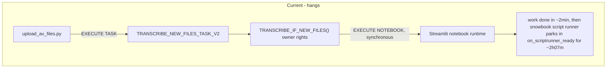
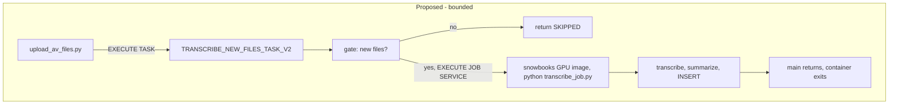

# Port transcription from EXECUTE NOTEBOOK to a headless GPU job service

## Context

### Why

The \~2h07m hang is **not in our code, and this is now proven** rather than inferred.

On 2026-08-19 a `faulthandler` watchdog was armed in the notebook teardown (`dump_traceback_later(120, repeat=True, exit=False)`, writing to a real fd via `sys.__stderr__`) and a hang was reproduced deliberately with the same 3-file workload that hung on 2026-08-18. The notebook finished all work and wrote its 3 rows normally, then dumps fired at +2min and +4min with an **identical** frame:

```
Thread 0x00007fcf7d7fa6c0:
  threading.py:355 in wait_for
  snowbook/runtime/notebook_script_requests.py:232 in on_scriptrunner_ready
  snowbook/runtime/notebook_script_runner.py:286 in _run_script_thread
MAIN THREAD:
  asyncio/base_events.py:603 in run_forever
  snowbook/snowflake/snowflake_run_adaptor.py:264 in run_till_end
  snowbook/snowflake/streamlit_base_adaptor.py:96 in start
  snowbook/web/cli.py:211 in main
```

`snowbook`'s script runner parks forever in `on_scriptrunner_ready` waiting on a condition variable while the main thread sits in `asyncio run_forever` serving gRPC. **No notebook code is on any stack** — every cell has completed. This is inside Snowflake's runtime and cannot be fixed from the notebook. `EXECUTE NOTEBOOK` is synchronous, so the calling task blocks with it.

**The hang is multi-file-only:** 0 of 8 single-file runs hung; **6 of 8** multi-file runs did
(updated 2026-08-19). Any reproduction must use 3+ files.

**It is intermittent — one clean run proves nothing.** Three 3-file runs on 2026-08-19 went
hang (10:07) / clean (15:21) / hang (15:52) within six hours. That clean run was nearly read as
the problem receding.

Three earlier hypotheses were **disproven** by the hung-run stacks and must not be re-investigated: lingering multiprocessing children (zero on every dump), GPU/CUDA cleanup (the hung run had cleanup and hung anyway), and `join_if_started` (present in healthy baselines only). The `resource_tracker: leaked semaphore` warning appears on healthy runs too and is noise.

The port remains the right move, and the evidence strengthens it: a plain Python script has no `snowbook` script runner, no Streamlit host, and no IPython kernel, so it removes the entire failure class rather than betting on a specific thread.

Switching notebook *varieties* (Warehouse vs Container Runtime, CPU vs GPU) would not help: all Snowflake notebooks are Streamlit-hosted, and Warehouse runtime cannot provide a GPU for Whisper.

**Interim mitigation already in place:** `USER_TASK_TIMEOUT_MS = 1800000` (30 min, task-scoped) caps the waste. Rows still land before the hang, so the data is correct while the task reports FAILED. Diagnostic instrumentation (`HANG_FORENSICS = True`) is currently armed in the deployed notebook — **leave it armed until the port is validated**; it produced the live 11-cycle stack capture on 2026-08-19 that proved the root cause, and it costs nothing on healthy runs (one baseline dump).

**The terminal error is not a stable signature.** Do not key validation or alerting on one error code. The 10:07 hang died at 1045s with error **604** "SQL execution canceled"; the 15:52 hang ran the full timeout and died at 1802s with error **000630** "Statement reached its statement or warehouse timeout of 1,800 second(s)". Neither message mentions notebooks or hanging. The durable signal is *transcripts present + task FAILED*, and the reliable tell is the gap between the last transcript write and the task end (7.5 min and ~10 min respectively) — not duration.

### Key findings from research

**No Docker image build is required.** The GPU Container Runtime image is available in the account:

```
snowflake/images/snowflake_images/st_plat/runtime/x86/generic_gpu/runtime_image/snowbooks:2.5.1-py310
```

This is the same `snowbooks` image family the notebook already runs on. Newer tags (2.7.0, 2.8.0) are py312-only; the notebook logs show `cpython-3.10`, so a `py310` tag matches the validated environment. `2.5.1-py310` is the newest py310.

**ffmpeg is already preinstalled** — telemetry confirms `ffmpeg version 6.1.1-3ubuntu5` plus `ffprobe` on every run. The `apt-get` fallback in notebook cell 8 has never fired, and scripts/install\_ffmpeg.sh is vestigial. This matters because job service containers are **non-privileged**, so `apt-get` would not have worked. Since we reuse the same image, ffmpeg comes for free and no static-binary or pip-wheel workaround is needed.

**Authentication inside the container differs from the notebook.** `get_active_session()` will not be available. Job service containers get an OAuth token file:

```python
def get_login_token():
    with open('/snowflake/session/token', 'r') as f:
        return f.read()

conn = snowflake.connector.connect(
    host=os.getenv('SNOWFLAKE_HOST'),
    account=os.getenv('SNOWFLAKE_ACCOUNT'),
    token=get_login_token(),
    authenticator='oauth',
)
```

The session runs as the **service owner role**. The token file is refreshed every few minutes; once connected, the connection is not bound to the token's 1-hour validity.

**`EXECUTE JOB SERVICE` is synchronous.** That is fine — the whole point is that a plain script exits when `main()` returns, so synchronous blocking is bounded by real work.

**Open risk on the launch site.** Owner's-rights stored procedures are documented to allow only SELECT, DML, DDL, GRANT/REVOKE, variable assignment, and DESCRIBE/SHOW. `EXECUTE JOB SERVICE` is not on that list, so it may be rejected inside `TRANSCRIBE_IF_NEW_FILES()` (`EXECUTE AS OWNER`) — the same way `LIST` was rejected earlier in this project. However `EXECUTE NOTEBOOK` works there today, so the allow-list is not strictly predictive. This must be tested early (task 2), with a clean fallback.

### Notebook inventory

\~**1,671** lines of code across 19 code cells (grew from \~1,312 when progress instrumentation was added on 2026-08-19). Realistic target is **650-750 lines** of headless Python, plus the progress emitter. The work concentrates in a few places:

- Cell 19 (`helper_functions`) is pure functions with no notebook coupling and ports nearly verbatim. It contains the load-bearing `import re`. It was 462 lines when this plan was written and has since gained progress emissions — re-measure before estimating.
- Cell 5 session bootstrap must be rewritten (OAuth instead of `get_active_session`, drop `session.use_role("SYSADMIN")`, drop the unused `Root(session)`).
- Cells 26, 30, 31, 32, 35 and cell 10 are presentation-only and get dropped, including the entire teardown apparatus.
- Cell 12 is a duplicate `openai-whisper` install and gets dropped.
- Cell 28's `except` branch is **dead and broken** — it supplies 14 positional values against a 23-column table. Do not port it; replace with a real error path.
- `media_files/` is a relative path dependent on cwd; use an absolute temp dir.

Only `openai-whisper` and `pandas` need installing; `torch` comes from the image.

### Architecture





The uploader, the task, and the gate logic are all unchanged in behaviour. Only the payload execution vehicle changes.

## Implementation steps

### 1. Spike: validate every assumption (do this first, before writing the payload)

Run a throwaway `EXECUTE JOB SERVICE` on `TRANSCRIPTION_GPU_POOL_V2` using the snowbooks GPU image, with `TRANSCRIPTION_PYPI_ACCESS_INTEGRATION_V2` and `TRANSCRIPTION_ALLOW_ALL_INTEGRATION_V2` attached, that prints:

- `sys.version` (expect 3.10, matching the notebook)
- `shutil.which('ffmpeg')`, `ffmpeg -version`, `shutil.which('ffprobe')`
- `torch.cuda.is_available()`, `torch.cuda.get_device_name(0)`
- OAuth connection working: `SELECT CURRENT_ROLE(), CURRENT_WAREHOUSE(), COUNT(*) FROM TRANSCRIPTION_RESULTS`
- Contents of the mounted `AUDIO_VIDEO_STAGE` volume
- Whether `pip install openai-whisper` succeeds and how long it takes

Also confirm log retrieval works via `SYSTEM$GET_SERVICE_LOGS` and that stdout reaches `SNOWFLAKE.TELEMETRY.EVENTS` for durable logs.

If ffmpeg is absent in this image (contradicting the notebook evidence), stop and reassess — options are a pip wheel bundling a static binary, a staged static binary, or a Custom Runtime Environment.

### 2. Decide the launch site

Test `EXECUTE JOB SERVICE` from inside an `EXECUTE AS OWNER` procedure.

- If permitted: swap `EXECUTE NOTEBOOK` for `EXECUTE JOB SERVICE` inside `TRANSCRIBE_IF_NEW_FILES()` — smallest possible change.
- If rejected: refactor so the gate procedure only **decides** (returns `LAUNCH` or `SKIP` plus the file count) and the **task body** performs `EXECUTE JOB SERVICE`. Task bodies run as the task owner and are not bound by the stored-procedure allow-list. This keeps the gate logic in one place and avoids granting the uploader's service role privileges on the compute pool.

Prefer the task-body variant if there is any doubt; it is more robust and does not change the security model.

### 3. Extract the headless payload

Create `scripts/payload/transcribe_job.py`:

- Config via `argparse` with env-var fallbacks: `--database`, `--schema`, `--stage`, `--results-table`, `--whisper-model`, `--force-retranscribe`, `--limit`, `--dry-run`, `--work-dir`
- OAuth session helper as shown above, wrapped so the same script can also run locally with a named connection (needed for task 4)
- ffmpeg/ffprobe preflight that fails fast with a clear message
- Port cell 19's 9 functions verbatim, keeping `import re`
- Convert the implicit globals cell 19 relies on (`model`, `session`, `DIARIZATION_AVAILABLE`, `diarization_pipeline`) into explicit parameters or a small class
- Explicit `device` selection plus a startup assertion on `torch.cuda.is_available()` so a misconfigured pool fails loudly instead of silently running on CPU
- Absolute temp work dir via `tempfile.mkdtemp()`, cleaned in a `finally`
- `logging` instead of `print`
- Preserve the dedup contract **exactly**: `SELECT DISTINCT FILE_NAME FROM <results_table>`, matched on bare filename. The SQL gate uses the same signal, so any drift makes the gate and payload disagree.
- Keep the 23-column INSERT in the same column order; drop the broken fallback. While porting, verify the `session.sql(insert_sql)` call is actually collected — cell 28 assigns the DataFrame without an obvious `.collect()` on that line.
- Exit non-zero on failure so the job service reports failure honestly

Add `scripts/payload/requirements.txt` with `openai-whisper` and `pandas`.

The Cortex model is **`claude-sonnet-4-6`**, verified against notebook line 1007. The earlier `claude-opus-4-5` reference in agents.md was stale documentation and has been corrected — port the notebook's value, and read it from config rather than hardcoding it again.

### 4. Validate the payload locally against a clone

Before any Snowflake wiring:

- `CREATE TABLE TRANSCRIPTION_RESULTS_PORTTEST CLONE TRANSCRIPTION_RESULTS` (zero-copy, free)
- Run the payload locally with `--results-table TRANSCRIPTION_RESULTS_PORTTEST` against the DoubleVerify file
- Diff all 23 columns against the row the notebook produced for the same file. Expect near-identical values; `PROCESSING_TIME_SECONDS` and `TRANSCRIPTION_TIMESTAMP` will differ, and the LLM summary text will vary run to run, but `MEETING_TITLE`, `CALL_BRIEF`, `KEY_POINTS`, `NEXT_STEPS` must be non-null and structurally correct.

The real `TRANSCRIPTION_RESULTS` is never written during this phase.

### 4b. Port the progress instrumentation — REQUIRED, not optional

**This step was missing from the original plan.** Without it the port silently kills a shipped
feature: the dashboard's Pipeline Status panel reads `V_TRANSCRIPTION_RUN_STATUS`, which is fed
*only* by the notebook's emissions. A payload that does not emit leaves every run showing `IDLE`,
the kickoff button permanently enabled, and the completeness percentage blank — with no error
anywhere to indicate why.

Port `RunProgress` from notebook cell 5 into the payload. It was written to be portable (plain
SQL INSERTs, no notebook APIs, `emit()` never raises), so this is close to a copy:

- Keep the schema of `TRANSCRIPTION_RUN_EVENTS` **unchanged** — 18 columns, append-only. The
  dashboard, the view and the derived-state logic all depend on it.
- Set `RUN_SOURCE = 'JOB_SERVICE'` instead of `'NOTEBOOK'` so old and new runs are
  distinguishable in history. Confirm the panel renders an unrecognised `RUN_SOURCE` gracefully
  — it is displayed as free text, so it should, but check rather than assume.
- Preserve the unit arithmetic exactly: `UNITS_TOTAL = 4 + (files × 4)`, with the four global
  units and four per-file steps (`EXTRACT_AUDIO`, `TRANSCRIBE`, `GENERATE_SRT`,
  `GENERATE_SUMMARY`). `finish_file()` must still snap to `baseline + 4` regardless of outcome,
  or a skipped or failed file leaves the percentage permanently short of 100%.
- Keep the six phases (`STARTUP`, `DISCOVER`, `DOWNLOAD`, `TRANSCRIBE`, `PERSIST`, `COMPLETE`)
  and `PHASE_TOTAL = 6`; `sf_config.PHASE_TOTAL` hardcodes 6.
- **Emit a real terminal state.** This is the one place the port should NOT copy the notebook.
  The notebook cannot report its own clean exit — the hang happens after the last cell — so its
  terminal state is `CELLS_COMPLETE` and the dashboard has to cross-check `TASK_HISTORY` to tell
  "finished" from "wedged". A headless script *can* report its own exit, so emit `SUCCEEDED` as
  the last statement before exit. Then `WORK_COMPLETE_NOT_EXITED` becomes genuinely diagnostic
  rather than routine: seeing it after the port would mean the job service has its own
  exit problem.
- Note the dashboard's `STARTING` state derives from "task EXECUTING, newest run terminal, last
  heartbeat older than task elapsed". That logic is launch-mechanism agnostic and should keep
  working, but the pre-emit window will change — a job service has no `pip install
  openai-whisper` ahead of the first emit if the image carries the deps, so `STARTING` may last
  seconds instead of 60-180s. Verify it does not flicker.

Validate on the clone run in task 4: the event stream should reach exactly `UNITS_DONE ==
UNITS_TOTAL` and `PCT_COMPLETE = 100.0`, with all four per-file steps present for every file.

### 5. Wire the launch path

- Add to scripts/00\_config.sql (the single source of truth): `PROJECT_JOB_IMAGE`, `PROJECT_JOB_NAME`, `PROJECT_STAGE_PAYLOAD`, plus derived `FQ_*`. Bump `CONFIG_REVISION` and republish with scripts/publish\_config.sh. **Also extend the `V_PROJECT_CONFIG` emitter at the bottom of that file** with the new names — it did not exist when this plan was written and is now how the dashboard resolves object names without drift.
- Reuse `NOTEBOOK_STAGE` for the payload or add a dedicated payload stage; either way pin the name in config, not inline.
- Author the service specification: one container on the snowbooks GPU image, `command` running `pip install -r requirements.txt && python transcribe_job.py`, a `stage` volume for the payload and one for `AUDIO_VIDEO_STAGE`, `resources` requesting `nvidia.com/gpu`, and env vars carrying the database/schema/table names.
- Modify scripts/03\_automate.sql per task 2. While in that file, wrap its bare `DECLARE...END;` blocks in `EXECUTE IMMEDIATE $$ ... $$` so it survives `snow sql -f` (existing known issue).
- Add a deploy script for the payload mirroring the verify-after-deploy discipline now in scripts/04\_deploy\_notebook.sh: upload, then confirm the staged bytes match local. Do not repeat the mistake of trusting an upload as proof of deployment.

### 6. End-to-end validation

Upload a real recording through `upload_av_files.py` and confirm the full chain. Then a second trigger with no new files to confirm the skip path.

### 7. Decommission and document

Retire the headless notebook path while keeping the notebook for interactive use. The notebook and the payload will share logic by copy, not by import — accept that duplication explicitly, or note the follow-up to have the notebook import the payload module from the stage.

## Verification

**Spike gates (task 1)** — do not proceed unless all pass:

- `which ffmpeg` and `which ffprobe` both resolve; `ffmpeg -version` reports 6.x
- `torch.cuda.is_available()` is True and names a GPU
- OAuth session returns the expected role and a row count matching `TRANSCRIPTION_RESULTS` at the time of the spike (**447 as of 2026-08-19** — read it live rather than asserting a literal, since this number moves with every run)
- The mounted AV stage volume lists media files

**Payload parity (task 4):**

- All 23 columns populated on the clone; `SUMMARY_MARKDOWN` and `MEETING_TITLE` non-null
- `PROCESSING_TIME_SECONDS / AUDIO_DURATION_SECONDS` ratio in the historical **0.006-0.090** band (median 0.037, mean 0.037, SD 0.0074 across 447 rows), confirming GPU execution. **Do not use a narrow 0.035-0.055 band** — an earlier draft of this plan did, and it would have failed a legitimate GPU run: the 26-minute Mediaocean file on 2026-08-19 came in at **0.0306**, below that floor. Short recordings run *high* because the Cortex summary is a near-fixed 25-50s cost that dominates; long ones run low. Sanity-check against duration, not a bare threshold.
- Re-running with the file already present inserts nothing

**Instrumentation parity (task 4b):**

- `TRANSCRIPTION_RUN_EVENTS` receives events with `RUN_SOURCE = 'JOB_SERVICE'`
- The run reaches exactly `UNITS_DONE == UNITS_TOTAL` and `PCT_COMPLETE = 100.0`; all four
  per-file steps present for every file
- A terminal `SUCCEEDED` event is emitted \u2014 the notebook could never do this, so its presence is
  the signal that the port genuinely exits
- The dashboard Pipeline Status panel renders the job-service run correctly, and the kickoff
  button is blocked while it is active. **A blank or `IDLE` panel during a live run means the
  instrumentation was not ported** \u2014 that is the specific silent failure this task exists to
  prevent.

**End-to-end (task 6):**

- Task `SUCCEEDED` with a real `RETURN_VALUE`, not `FAILED`
- Task duration approximately equals actual work time (expect roughly 2-4 minutes for an 8-minute recording), with **no multi-hour tail**
- Container exits on its own; no `092848 UNAVAILABLE` and no forced exit involved
- `TRANSCRIPTION_RESULTS` count increments by exactly 1
- Second trigger returns `SKIPPED` in seconds and launches no GPU
- Compute pool history shows one job, not a phantom 2-hour session

**Regression guard:** confirm `TRANSCRIPTION_RESULTS` never drops below its pre-change count at any point. Take a zero-copy clone as a backup before the first write to the real table, matching the `TR_BACKUP_GOOD` pattern already in use.

**Honest success criterion:** the hang is multi-file-specific — **6 of 8** multi-file runs hung, 0 of 8 single-file runs did. A single-file job therefore proves **nothing** about the hang; it sits in the regime that never failed. Validate with **3+ file** runs, and treat the hang as resolved only after several consecutive multi-file runs with no multi-hour tail. Given the observed hang/clean/hang sequence within six hours on 2026-08-19, "several" means **at least 4 consecutive clean multi-file runs**, not one or two. Keep the `USER_TASK_TIMEOUT_MS` cap in place until then.

## Critical files

- notebooks/audio\_video\_transcription.ipynb - source of the payload logic; cell 19 ports near-verbatim, cell 28 holds the authoritative 23-column INSERT, cell 5 holds the `RunProgress` class that must port with it
- scripts/03\_automate.sql - gate procedure and task definition; where `EXECUTE NOTEBOOK` becomes `EXECUTE JOB SERVICE`
- scripts/00\_config.sql - single source of truth for all object names; new job/image variables go here and nowhere else
- scripts/04\_deploy\_notebook.sh - the deploy-then-verify pattern the new payload deploy script should mirror
- av.uploader/upload\_av\_files.py - trigger path; should require no changes, which is itself worth verifying
