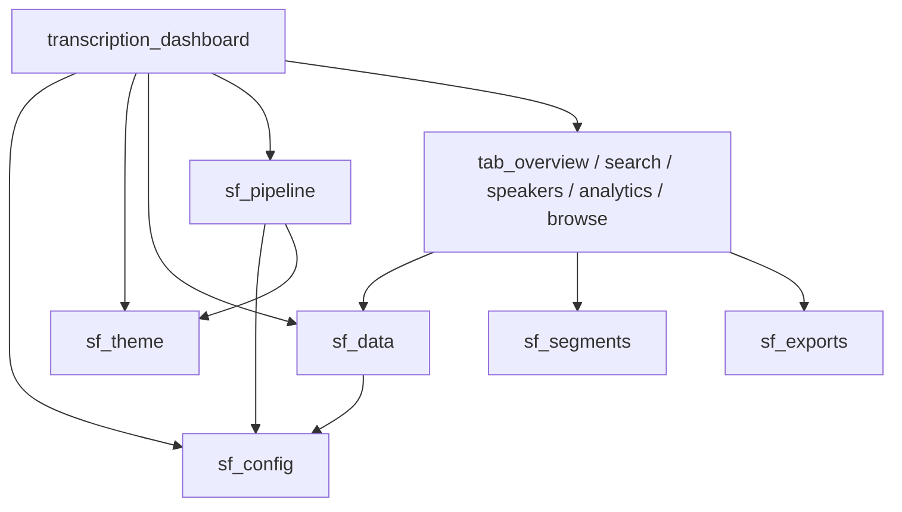

# Transcription Dashboard

Reference for `streamlit/` — the Streamlit-in-Snowflake app. Written primarily as the
input for a future port to Snowflake App Runtime, so it records the constraints that shape
the current design rather than just describing the code.

Architecture for the pipeline as a whole is in [architecture.md](architecture.md).
Operating procedures are in [../operations/runbook.md](../operations/runbook.md).

---

## 1. What it is

| | |
|---|---|
| Object | `TRANSCRIPTION_DB_V2.TRANSCRIPTION_SCHEMA_V2.TRANSCRIPTION_DASHBOARD` |
| Title | `transcription_dashboard_v3` |
| Owner | **`TRANSCRIPTION_APP_ROLE`** (least privilege, not ACCOUNTADMIN) |
| Runtime | **Warehouse** runtime, `TRANSCRIPTION_WH_V2` |
| Source type | `FROM`-based (not legacy `ROOT_LOCATION`) |
| Source | `@…STREAMLIT_STAGE/TRANSCRIPTION_DASHBOARD/` |
| Entrypoint | `transcription_dashboard.py` (**must** be at the source root) |
| Streamlit | **pinned to 1.52.2** via `environment.yml` (see §3a) |
| Python | 3.11 |
| Deploy | `scripts/09_deploy_dashboard.sh` — **the only supported path** |

Open via **Projects » Streamlit**. Do not bookmark the direct URL: every deploy does
`CREATE OR REPLACE`, which assigns a new `url_id` and 404s the old link.

## 2. Module layout

Flat by requirement, not preference. Warehouse runtime requires the entrypoint in the root
of the source directory, and the documented structure places sibling modules alongside it.
A `lib/` subpackage would probably work but is not the documented shape.

**There must never be a `pages/` directory.** Streamlit treats `pages/` as automatic
multipage navigation, which would silently restructure the app. Tab modules are named
`tab_*.py` for this reason, and the deploy script hard-fails if `pages/` appears.

```
streamlit/
├── .streamlit/config.toml   theme only
├── environment.yml          Python + Streamlit version pin - NOT optional, see §3a
├── transcription_dashboard.py   entrypoint: page config, sidebar, status block, tabs
├── sf_config.py             session, NAMES holder, constants
├── sf_theme.py              BRAND palette, CSS, status card, brand_header
├── sf_data.py               queries against TRANSCRIPTION_RESULTS
├── sf_pipeline.py           run status, task state, backlog, controls
├── sf_segments.py           speaker-segment matching and rendering
├── sf_exports.py            CSV/SRT builders, download helpers
├── tab_overview.py          render(df, stats)
├── tab_search.py            render(session, df)
├── tab_speakers.py          render(session, df)
├── tab_analytics.py         render(df)
└── tab_browse.py            render(session, df)
```

Dependency graph is an acyclic DAG; no tab imports the entrypoint.



## 3. Configuration: how names are resolved

`sf_config.init(session)` resolves in this order:

1. **`TRANSCRIPTION_DEPLOY.PUBLIC.V_PROJECT_CONFIG`** — the authoritative projection of
   `scripts/00_config.sql`. This is what keeps the dashboard, the notebook and the SQL
   scripts on one authored source.
2. **Session context** — the app's own database/schema. Correct for location; object names
   fall back to defaults.
3. **Hardcoded V2 fallback** — so a config outage degrades rather than breaking the app.

The sidebar shows which path was used plus the config revision, so drift is visible instead
of silent.

**Why the app cannot just run `00_config.sql`.** Warehouse-runtime Streamlit executes as an
owner's-rights stored procedure, and those reject session variables outright:

```
090244 (42601): Use of session variable '$PROJECT_DB' is not allowed in
                owners rights stored procedure
```

`EXECUTE IMMEDIATE FROM …/00_config.sql` therefore fails on its first `SET`. Reading the
view is the supported alternative. (`session.file.get_stream()` *can* read the raw file, so
parsing it in Python is technically possible — rejected as regex-parsing SQL.)

**The `NAMES` holder is deliberately a mutable object, not module constants.** Names come
from the live session, so `from sf_config import T_RESULTS` would bind the fallback at
*import* time, before the session exists, and every query would silently target the wrong
deployment without raising. Consumers read `NAMES.T_RESULTS` at call time. The pre-flight
linter fails the build on any module-level `NAMES.*` read.

## 3a. The Streamlit version pin

**`environment.yml` is not optional.** With no `environment.yml`, Snowflake resolves the
**oldest** supported Streamlit — **1.22.0**, from 2023 — not the newest. The app ran that
way from creation until 2026-08-19.

That silently degraded several components. `st.file_uploader` was the only one that
hard-errored (`Unsupported component error: st.file_uploader is unsupported in Streamlit
1.22.0`); the rest simply did not do what the code asked:

| Component | Needs | Used by |
|---|---|---|
| `st.dataframe(hide_index=)` | 1.23 | every table |
| `st.column_config` | 1.23 | overview and analytics tables |
| `st.download_button` | 1.26 | CSV / SRT export |
| `st.file_uploader` | 1.26 | in-app media upload |
| `st.scatter_chart` | 1.27 | processing time vs duration |
| `st.fragment` | 1.37 | scoped status refresh |
| `x_label` / `y_label` on built-in charts | 1.39 | axis labels |

The file **must sit in the root of the source directory**, beside the entrypoint. In a
subdirectory it is ignored silently.

**Do not pin `python` in this file**, even though the Snowflake docs example shows
`- python=3.11`. On a warehouse-runtime `STREAMLIT` object the entry is translated into a
Python function package spec of `python==3.11`, which is not a resolvable package name, and
the app dies at load:

```
SQL compilation error: Cannot create a Python function with the specified packages.
'Packages not found: python==3.11'
```

Note the base environment reports `python==3.11.*` — with the `.*` — so the interpreter is
already 3.11 and needs no pin. This took the app down on 2026-08-19. `lint_dashboard.py` now
rejects a `python` entry outright.

Verify with `DESCRIBE STREAMLIT …` and read the two package columns:

- `user_packages` — what `environment.yml` asked for. Should contain `streamlit==1.52.2`.
- `default_packages` — the base environment. **Always** contains a bare, unpinned
  `streamlit`, regardless of the pin. Do not assert against this column; matching it is a
  guaranteed false positive. The deploy script's first version of this check did exactly
  that and failed a working deploy.

Other constraints: only the Snowflake Anaconda Channel is available (no pip/PyPI on
warehouse runtime); pin with `=` not `==` in the yml; and only the documented subset of
Streamlit versions works, which is narrower than what the channel carries.

## 4. Owner's rights: what the app can and cannot do

The app runs with the privileges of `TRANSCRIPTION_APP_ROLE` for **every viewer**. All of
the following were verified empirically on 2026-08-19 against an owner's-rights procedure.

| Operation | Works? | Note |
|---|---|---|
| `SELECT` on tables/views | yes | |
| `EXECUTE TASK` | **yes** | Absent from the documented allow-list, but works |
| `CALL` a procedure | yes | Gate proc returns SKIPPED without launching a GPU |
| `session.file.put_stream` | yes | The upload path |
| `LIST` | yes | Permitted for Python handlers, unlike SQL/JS handlers |
| `ALTER STAGE … REFRESH` | yes | DDL |
| `DIRECTORY()` | yes | |
| `TASK_HISTORY` table function | yes | `OPERATE` suffices; no `MONITOR` needed |
| `REMOVE` (delete stage file) | **NO** | `Unsupported statement type 'REMOVE_FILES'` |
| Session variables | **NO** | `090244`, see above |

Consequence worth remembering: **the app can never offer a delete-file button** on
warehouse runtime.

### Grants held by `TRANSCRIPTION_APP_ROLE`

`USAGE` on database/schema/warehouse and on `TRANSCRIPTION_DEPLOY`; `SELECT` on
`TRANSCRIPTION_RESULTS`, `TRANSCRIPTION_RUN_EVENTS`, `V_TRANSCRIPTION_RUN_STATUS`,
`TRANSCRIPTION_SUMMARY`, `V_PROJECT_CONFIG`; `OPERATE` on the task; `USAGE` on the gate
procedure; `READ, WRITE` on `AUDIO_VIDEO_STAGE`; `CREATE STREAMLIT` on the schema and
`READ` on `STREAMLIT_STAGE`.

Deliberately **not** granted: `INSERT` on the run-events table (the app only reads
progress; the notebook writes it), `READ SESSION`, anything on the compute pool.

### Ownership cannot be transferred

`GRANT OWNERSHIP ON STREAMLIT` is **unsupported** — Snowflake rejects it with
`Unsupported feature GRANT/REVOKE OWNERSHIP ON STREAMLIT`. An app permanently runs as the
role that *created* it. The only way to change the owner is to recreate the object while
using the target role, which is exactly what the deploy script does via the CLI's `--role`
flag. A wrong owner is a privilege escalation, so the script treats it as a hard failure.

Note `USE ROLE` is rejected through `snow sql` on the PAT-bound connection
(`003107 Current session is restricted`) but works through other client paths against the
same account. Do not "simplify" the `--role` flag back to a `USE ROLE` statement.

## 5. Pipeline status and controls

`sf_pipeline` is the only module reaching outside `TRANSCRIPTION_RESULTS`. Nothing in it is
cached — the point is a live view.

The completeness percentage is a **measurement, not an estimate**: the notebook counts a
work unit only when it actually finishes, with no time interpolation. Units are
`4 + (files × 4)`.

### Hang detection

The notebook **cannot report its own clean exit**. The `snowbook` shutdown hang occurs
*after* the last cell, during interpreter shutdown, so any code in the teardown cell runs
on a hung run too. Its terminal state is therefore `CELLS_COMPLETE`, and distinguishing
"exited" from "wedged" requires `TASK_HISTORY` — a `CELLS_COMPLETE` run whose task is still
`EXECUTING` is the hang. **Never add a notebook-side `SUCCEEDED` emission**; it would be
written on hung runs and hide the very thing it was meant to expose.

| `DERIVED_STATE` | Meaning |
|---|---|
| `STARTING` | Task is `EXECUTING` but nothing emitted yet — see below |
| `RUNNING` | heartbeat fresh |
| `FINISHING` | rows committed, container winding down |
| `CELLS_COMPLETE` | all cells done; cross-checked against `TASK_HISTORY` |
| `WORK_COMPLETE_NOT_EXITED` | **the hang** — data is safe, container wedged |
| `STALLED` | no heartbeat for `RUN_STALE_SECS` (600) |
| `SUCCEEDED` / `FAILED` | terminal |

The 600s threshold is validated against real data: the largest observed gap between
heartbeats is 49s (one Whisper call), second largest 38s (Cortex). Re-check it if the
Whisper model is upsized — `large` is roughly 10x slower than `base`.

### `STARTING`: the pre-emit window

`STARTING` is **not** a state the notebook reports — it is derived when the task is
`EXECUTING` but no run has emitted anything yet. That window is real and long: the first
`emit()` sits at line 147 of notebook cell 5, but `!pip install openai-whisper pandas` is at
line 4 of the same cell, so nothing is reported until torch and Whisper finish installing.
**Measured: 62s to first event on a warm pool; ~125s on a cold one.**

Without this state the panel showed the *previous* run's terminal card for minutes after a
kickoff, which reads as "nothing happened" — or worse, as if the old run were the current
one. When `STARTING`, the stale run's phase and unit counts are **suppressed**, because
rendering "16 of 16 units (100%)" next to a run that has not begun is actively misleading.

Distinguishing `STARTING` from the hang is subtle, because both are "task `EXECUTING`, newest
run terminal". They are separated by **age, not state**: if the last heartbeat is *older* than
the task's own elapsed time, that heartbeat cannot belong to this execution, so a new run is
starting. Comparing the two elapsed counters avoids parsing timestamps across timezones.
Equality is treated as the hang — flagging a hang wrongly is safer than hiding one.

`STARTING` also blocks the kickoff button. `IS_ACTIVE` is false during this window, so keying
only on `IS_ACTIVE` left the button live right after a kickoff. `ALLOW_OVERLAPPING_EXECUTION
= FALSE` would reject the second run, so it was never dangerous — but the button appeared to
do nothing, which is a poor way to discover that.

### Reading a hang off the dashboard

The panel cross-checks `TASK_HISTORY` on **every** poll, so green `COMPLETE` is itself the
all-clear — no manual query needed:

| Card | Meaning |
|---|---|
| green `COMPLETE` | Cells done **and** the task returned. Clean. |
| orange `HUNG (work saved)` | Cells done, task still `EXECUTING`. The hang. |

Signature of a real hang, from the verified 2026-08-19 10:07 run (3 files):

```
10:07:47  task starts, gate finds 3 new files
10:12:14  file 1 written
10:15:03  file 2 written
10:17:42  file 3 written   <- all work done
          ...7.5 min of nothing...
10:25:12  task FAILED, error 604 "SQL execution canceled"
```

Three numbers worth remembering:

- **Normal teardown is ~11s** (clean run: last event 15:27:21, task returned 15:27:32). So
  `CELLS_COMPLETE` with the task still running past ~60s is a hang, not slow shutdown.
- **The terminal error varies — do not key alerting on one code.** Two hangs on 2026-08-19 ended
  differently: 10:07 died at **1045s, error 604** "SQL execution canceled"; 15:52 ran the full
  timeout and died at **1802s, error 000630** "Statement reached its statement or warehouse
  timeout of 1,800 second(s)". Neither message mentions notebooks or hanging. Key on
  *transcripts present + task FAILED* instead.
- **The reliable tell is the gap** between the last transcript write and the task end, not the
  duration — 7.5 min and ~10 min respectively.

This path was validated against a **live** hang on 2026-08-19 (the 15:52 run): the card correctly
showed `HUNG (work saved)` while the container sat wedged for 30 minutes, and `_n()` rendered
`16 of 16 units complete (100.0%)` with the per-file line suppressed rather than `File nan of nan`.

### Cost controls

Deliberate, given this project's history of a ~230-credit runaway:

- Auto-refresh is a sidebar toggle defaulting to **OFF**; each poll costs queries.
- `ALTER STAGE REFRESH` is **opt-in** via "Rescan stage" — it walks all 300+ stage files,
  so running it on every 5s poll would be real waste.
- The status block is wrapped in `st.fragment` when available so a refresh re-runs only
  that block. There is no `@st.cache_data` anywhere, so a full rerun re-executes every
  query.

### Kickoff

Uses `EXECUTE TASK`, which is asynchronous — it queues and returns. A synchronous `CALL` of
the gate would run `EXECUTE NOTEBOOK` inline and hold the app's session for the entire
transcription, bounded by the warehouse's 4-hour `STATEMENT_TIMEOUT` rather than the task's
30-minute cap.

**Concurrency authority is the task**, via `ALLOW_OVERLAPPING_EXECUTION = FALSE`. The UI
check is advisory and racy: two viewers can pass it simultaneously. The platform is what
actually prevents a second concurrent run.

### Upload

`put_stream`, because `PUT` reads from a client filesystem that does not exist here.

- **`auto_compress=False` is required.** Gzipping media breaks `ffprobe` duration detection
  and the extension check, and the file would sit on the stage looking fine while never
  transcribing.
- **`ALTER STAGE REFRESH` afterwards is required.** `put_stream` does not register the file
  in the directory table, so without it neither the backlog count nor the task gate can see
  the upload.
- `overwrite=False` protects existing recordings.
- **200 MB is a hard cap** on warehouse runtime, not configurable. 80 of 443 existing
  recordings (18%) exceed it, the largest 1.7 GB. In-app upload is a convenience path, not
  a replacement for `av.uploader`.
- Filenames are validated against the notebook's `parse_filename_metadata()` contract,
  `YYYY-MM-DD HH-MM-SS_AccountName[_rest].ext`. A non-conforming name still transcribes but
  lands with `ACCOUNT_NAME` and `CALL_START_TS` NULL, so this warns rather than blocks.

Upload does **not** auto-trigger a run; the two actions are deliberately separate.

## 6. Theming

Base colors come from `.streamlit/config.toml`; `[theme]` and `[theme.sidebar]` are the
only sections warehouse runtime supports.

**Lato is impossible here and should not be re-attempted.** The brand guideline loads it
from the Google Fonts CDN, but SiS runs under a Content Security Policy that blocks fonts
from external domains, and warehouse runtime has no static file serving to self-host it.
`font = "sans serif"` is the honest ceiling.

**A theme that applies is not the same as a theme you can see.** The first attempt used the
brand's `#F0F7FB` tint, which is visually indistinguishable from Streamlit's default
`#F0F2F6` — correctly applied, imperceptible. Heading colour and the Snowflake Blue rule
under H2 are what actually make it read as Snowflake, and those are only reachable via CSS.

`config.toml` was previously restricted to long-standing options because warehouse runtime
resolved an unpinned Streamlit and an unrecognised option risked the theme being discarded.
**That constraint is gone** now that `environment.yml` pins 1.52.2 — the newer options
(`borderColor`, `chartCategoricalColors`, `baseRadius`, `linkColor`) are available and are a
reasonable next step for the visual pass. They are simply not used yet.

Semantic status colours (green/orange/red) are deliberately **not** branded — a wedged
container must remain visually distinct from a healthy run.

## 6a. Visualization choices

Reworked 2026-08-19. The governing rule: **`value_counts()` on a continuous column is a
bug, not a chart.** File size in MB and transcript word count are effectively continuous, so
nearly every value was unique and every bar had height 1. A distribution over continuous
data needs binning (`pd.cut`). Two charts were wrong this way.

| Panel | Now | Why |
|---|---|---|
| File Types (Overview) | Table | Three categories with a count each. A chart spends axes and gridlines to convey three numbers, and cannot carry the share column |
| Language Distribution (Overview) | Table | The corpus is ~95% one language, so a bar chart is one tall bar beside a row of slivers. The long tail is the interesting part, and the table adds audio hours to answer "real second language, or three stray files?" |
| Processing time vs duration | Scatter, both axes labelled, in **minutes** | Recordings run to hours; four-digit second counts are unreadable as axis labels. Caption states the realtime ratio, which is the number that matters for capacity planning |
| File size distribution | **Cumulative GB over time** | Replaces the height-1 histogram. Corpus growth is the storage-planning question |
| Processing efficiency by file type | Table | The useful output is four numbers per type (n, mean duration, mean runtime, ratio), which a single-series bar chart cannot show. Ratio is **duration-weighted** (`sum/sum`), so a 30-second clip does not outweigh a two-hour call |
| Transcript length | **Binned histogram** + median/min/max, and a warning count for transcripts under 100 words | Bins make the shape readable. The short-transcript count is the actionable signal: it usually means silence, a failed audio extract, or non-speech audio rather than a genuinely brief meeting |

**Removed:** *Speaker Count Distribution* and *Files with Speaker Data by Language*.
`SPEAKER_COUNT` comes from a duration-and-gap heuristic, not real diarization, so charting
its distribution presented a guess with the authority of a measurement. Revisit once video
runs can attribute speech per frame (`AI_MULTI_EMBED` over the video alongside the audio
transcript). Until then there is nothing trustworthy to plot — this is recorded in
`tab_analytics.py`'s module docstring so it is not "restored" as a regression.

## 7. Deploy and pre-flight

`scripts/09_deploy_dashboard.sh`:

1. **Pre-flight** (`scripts/lint_dashboard.py`) — undefined names, tab `render()` arity
   against actual call sites, module-level `NAMES` reads, stdlib shadowing, `pages/`.
2. Reads names from the config store.
3. **Clears stale staged files.** `CREATE OR REPLACE … FROM` *copies* the stage directory
   rather than diffing, so a module deleted locally would linger and could shadow a real or
   stdlib name.
4. Uploads modules, `.streamlit/config.toml`, and `environment.yml`. A missing
   `environment.yml` is a **hard failure**, not a warning — the app still loads without it,
   so omitting it would silently ship a 2023 Streamlit.
5. Recreates the app as the app role.
6. **Verifies** every file by download-and-diff, asserts the owner, and asserts that
   `user_packages` contains a pinned `streamlit==<version>`.

The pre-flight also rejects an `environment.yml` that is missing, that pins `python`, or
that leaves `streamlit` unpinned — all three are silent-failure modes. Both negative cases
were tested against the linter rather than assumed.

**What the deploy script cannot catch:** it verifies the files, the owner and the package
spec, but it does not load the app. A package set that Snowflake accepts at `CREATE` time
can still fail at *render* time — which is exactly how the `python==3.11` pin got through a
fully "verified" deploy. **Always open the app after deploying.**

The pre-flight exists because of a real escape: the first modular deploy shipped with
`sf_exports` missing a `datetime` import and `tab_browse` referencing `session` without
accepting it. `python -m compileall` passed both, because it proves a module *parses*, not
that the names it references exist. Recursive `snow stage copy` additionally needs
`--database`/`--schema` even with a fully-qualified path, or it fails with `090105`.

## 8. Port notes for App Runtime

Things that must change or be removed:

- **`get_active_session()`** is warehouse-runtime-only and not thread-safe. Container and
  App Runtime need `st.connection("snowflake")`.
- **`srt_download_link()`** exists solely to work around Snowsight appending `?title=` and
  breaking presigned URLs. Delete it rather than port it.
- **Four f-string SQL interpolation sites** in `sf_data` (`search_transcriptions`,
  `get_speaker_segments`) must be parameterised before this code runs anywhere less
  trusted. New code in `sf_pipeline` already uses no interpolation of user input.
- **`convert_search_results_to_srt`** builds SRTs client-side, inconsistent with the
  pipeline's pre-generate-at-transcription-time rule. Its dead sibling
  `convert_speaker_segments_to_srt` was deleted; this one is still live.
- **`_snowflake` module** is unavailable outside warehouse runtime — not used today, but
  relevant if secrets are ever added.

Limits a port would lift: the 200 MB upload cap, the 32 MB message-size limit,
single-session-only caching, no package-based v2 components, and the owner's-rights
statement restrictions (which would make `REMOVE` and session variables available).

**Container runtime is the smaller step and lifts the same limits.** Weigh it before
committing to App Runtime: it keeps the Streamlit code essentially as-is while removing the
upload cap and the statement restrictions, and it enables real Lato via static file
serving.

Known cosmetic debt, unchanged by the refactor: `get_speaker_segments` is called twice per
render in the speaker tab, and Browse Data is capped at `.head(20)` while the sidebar
advertises up to 2000 records.
